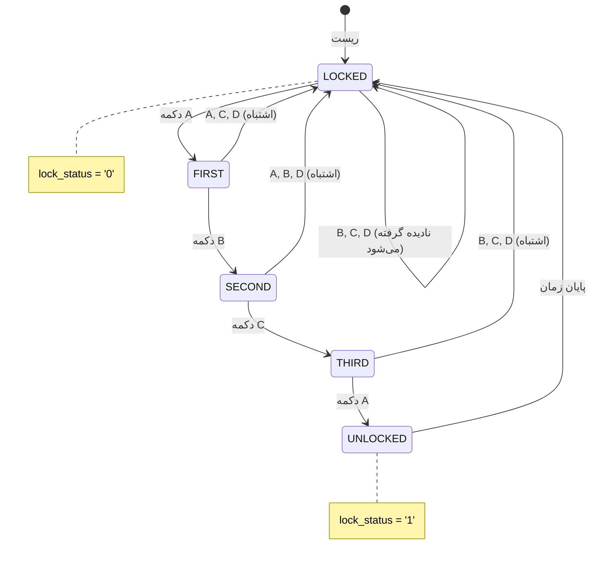

> **[🇬🇧 English Version](README.md)**

# قفل دیجیتال مبتنی بر الگو

یک پیاده‌سازی سخت‌افزاری از قفل دیجیتال مبتنی بر الگو با استفاده از ماشین حالت متناهی (FSM) در VHDL. این قفل نیاز به یک توالی خاص ۴ دکمه‌ای (A → B → C → A) برای باز شدن دارد و دارای قابلیت‌های قفل خودکار مجدد، حذف نویز دکمه و مدیریت جامع خطا است.

<details>
<summary>VHDL چیست؟</summary>

VHDL (زبان توصیف سخت‌افزار VHSIC) یک زبان برنامه‌نویسی برای توصیف مدارهای دیجیتال است. برخلاف نرم‌افزار که روی پردازنده اجرا می‌شود، کد VHDL سخت‌افزار واقعی را توصیف می‌کند که به چیپ‌ها (FPGA یا ASIC) تبدیل می‌شود. آن را مانند نقشه‌ای برای مدارهای الکترونیکی در نظر بگیرید.

</details>

---

## فهرست مطالب

- [ویژگی‌ها](#ویژگیها)
- [شروع سریع](#شروع-سریع)
- [ساختار پروژه](#ساختار-پروژه)
- [نحوه کارکرد](#نحوه-کارکرد)
- [ساخت و اجرا](#ساخت-و-اجرا)
- [تست](#تست)
- [سنتز برای FPGA](#سنتز-برای-fpga)
- [مشاهده شکل موج](#مشاهده-شکل-موج)
- [عیب‌یابی](#عیبیابی)
- [مستندات](#مستندات)

---

## ویژگی‌ها

- **قفل الگویی امن**: توالی باز کردن ۴ دکمه‌ای (A → B → C → A)
- **حذف نویز دکمه**: فیلتر کردن نوسانات مکانیکی دکمه برای ورودی قابل اعتماد
- **تایمر قفل خودکار**: قفل شدن خودکار پس از یک بازه زمانی قابل تنظیم
- **محافظت در برابر ورودی اشتباه**: بازگشت به حالت قفل شده با فشردن دکمه نادرست
- **کاملاً قابل سنتز**: آماده برای پیاده‌سازی روی FPGA
- **مجموعه تست جامع**: بیش از ۴۴ بررسی تست در ۵ تست‌بنچ

---

## شروع سریع

### پیش‌نیازها

- **GHDL**: شبیه‌ساز متن‌باز VHDL
- **GTKWave** (اختیاری): نمایش‌دهنده شکل موج برای اشکال‌زدایی

<details>
<summary>نصب GHDL و GTKWave روی Ubuntu/Debian</summary>

```bash
sudo apt update
sudo apt install ghdl gtkwave
```

</details>

<details>
<summary>نصب GHDL و GTKWave روی macOS</summary>

```bash
brew install ghdl
brew install --cask gtkwave
```

</details>

<details>
<summary>نصب GHDL و GTKWave روی Windows</summary>

1. دانلود GHDL از: https://github.com/ghdl/ghdl/releases
2. دانلود GTKWave از: https://gtkwave.sourceforge.net/
3. هر دو را به PATH سیستم اضافه کنید

</details>

### اجرای اولین شبیه‌سازی

**استفاده از اسکریپت‌ها (پیشنهادی):**

```bash
# رفتن به دایرکتوری پروژه
cd pattern-based-digital-lock

# نصب وابستگی‌ها (فقط بار اول)
./scripts/install.sh

# ساخت و تست
./scripts/build.sh
./scripts/test.sh

# مشاهده شکل موج‌ها (اختیاری)
./scripts/wave.sh
```

<details>
<summary>دستورات دستی (در صورت تمایل)</summary>

```bash
# کامپایل همه فایل‌های منبع
ghdl -a --std=08 src/digital_lock.vhd
ghdl -a --std=08 src/button_debouncer.vhd
ghdl -a --std=08 src/top_level.vhd

# کامپایل و اجرای تست‌بنچ اصلی
ghdl -a --std=08 testbench/tb_digital_lock.vhd
ghdl -e --std=08 tb_digital_lock
ghdl -r --std=08 tb_digital_lock --wave=simulation/tb_digital_lock.ghw

# مشاهده نتایج
gtkwave simulation/tb_digital_lock.ghw
```

</details>

<details>
<summary>معنی دستورات GHDL چیست؟</summary>

- `ghdl -a`: **تحلیل** (کامپایل) یک فایل VHDL، بررسی خطاهای نحوی
- `ghdl -e`: **توسعه** (لینک) یک طراحی، آماده‌سازی برای شبیه‌سازی
- `ghdl -r`: **اجرای** شبیه‌سازی
- `--std=08`: استفاده از استاندارد VHDL-2008
- `--wave=file.ghw`: ذخیره شکل موج‌های سیگنال در یک فایل برای مشاهده

</details>

---

## ساختار پروژه

```
pattern-based-digital-lock/
├── README.md                 # این فایل
├── README-fa.md              # نسخه فارسی
├── PRD.md                    # سند نیازمندی‌های محصول
├── scripts/                  # اسکریپت‌های اتوماسیون
│   ├── README.md
│   ├── install.sh            # نصب وابستگی‌ها
│   ├── build.sh              # کامپایل فایل‌های منبع
│   ├── test.sh               # اجرای تست‌بنچ‌ها
│   ├── synth.sh              # بررسی قابلیت سنتز
│   ├── wave.sh               # باز کردن نمایش‌دهنده شکل موج
│   └── clean.sh              # حذف فایل‌های تولید شده
├── src/                      # فایل‌های منبع VHDL
│   ├── README.md
│   ├── digital_lock.vhd      # کنترلر اصلی FSM
│   ├── button_debouncer.vhd  # مدار حذف نویز دکمه
│   └── top_level.vhd         # یکپارچه‌سازی سیستم
├── testbench/                # فایل‌های تست
│   ├── README.md
│   ├── tb_digital_lock.vhd   # تست‌های واحد FSM
│   ├── tb_top_level.vhd      # تست‌های کامل سیستم
│   ├── tb_fsm_coverage.vhd   # تست‌های پوشش حالت
│   ├── tb_edge_cases.vhd     # تست‌های شرایط مرزی
│   └── tb_debouncer.vhd      # تست‌های واحد debouncer
├── simulation/               # خروجی‌های شبیه‌سازی
│   ├── README.md
│   └── *.ghw                 # فایل‌های شکل موج
├── synthesis/                # خروجی‌های سنتز
│   └── README.md
└── docs/                     # مستندات تفصیلی
    ├── digital_lock.md
    ├── button_debouncer.md
    ├── top_level.md
    └── testbenches.md
```

---

## نحوه کارکرد

### نمای کلی ماشین حالت

قفل به صورت یک ماشین حالت متناهی ۵ حالته کار می‌کند:



<details>
<summary>نمودار متنی (اگر Mermaid رندر نمی‌شود)</summary>

```
                    ┌──────────────────────────────────────────┐
                    │                                          │
                    ▼                                          │
    ┌─────────┐    A    ┌─────────┐    B    ┌─────────┐    C    ┌─────────┐    A    ┌──────────┐
    │ LOCKED  │────────▶│ FIRST   │────────▶│ SECOND  │────────▶│ THIRD   │────────▶│ UNLOCKED │
    └─────────┘         └─────────┘         └─────────┘         └─────────┘         └──────────┘
         ▲                   │                   │                   │                    │
         │                   │ دکمه              │ دکمه              │ دکمه               │ پایان
         │                   │ اشتباه            │ اشتباه            │ اشتباه             │ زمان
         └───────────────────┴───────────────────┴───────────────────┴────────────────────┘
```

</details>

<details>
<summary>درک ماشین‌های حالت</summary>

یک ماشین حالت متناهی (FSM) مانند یک فلوچارت است که سخت‌افزار از آن پیروی می‌کند:

1. **حالت‌ها**: حالت‌های مختلفی که سیستم می‌تواند در آن باشد (LOCKED، FIRST، SECOND و غیره)
2. **انتقال‌ها**: قوانین حرکت بین حالت‌ها (مثلاً "اگر دکمه A فشرده شد، به FIRST برو")
3. **خروجی‌ها**: کاری که سیستم در هر حالت انجام می‌دهد (مثلاً lock_status = '0' در LOCKED)

قفل از حالت LOCKED شروع می‌شود و فقط با فشردن دکمه‌ها به ترتیب دقیق A → B → C → A به حالت UNLOCKED می‌رسد

</details>

### توالی باز کردن


| مرحله | فشردن | حالت فعلی | حالت بعدی |
|-------|-------|-----------|-----------|
| ۱     | A     | LOCKED    | FIRST     |
| ۲     | B     | FIRST     | SECOND    |
| ۳     | C     | SECOND    | THIRD     |
| ۴     | A     | THIRD     | UNLOCKED  |

### مدیریت خطا

- **دکمه اشتباه**: بازگشت فوری به حالت LOCKED
- **سیگنال ریست**: بازگشت به LOCKED از هر حالتی
- **پایان زمان**: قفل خودکار پس از زمان قابل تنظیم (پیش‌فرض: ۵ سیکل کلاک در شبیه‌سازی)

---

## ساخت و اجرا

### استفاده از اسکریپت‌ها (پیشنهادی)

```bash
# ساخت همه فایل‌های منبع
./scripts/build.sh

# اجرای همه تست‌ها
./scripts/test.sh

# اجرای یک تست خاص
./scripts/test.sh tb_digital_lock

# اجرای تست‌ها بدون تولید شکل موج (سریع‌تر)
./scripts/test.sh --no-wave

# مشاهده شکل موج‌ها
./scripts/wave.sh tb_digital_lock

# پاک‌سازی artifacts ساخت
./scripts/clean.sh
```

<details>
<summary>دستورات کامپایل دستی</summary>

```bash
# تحلیل (کامپایل) فایل‌های منبع به ترتیب وابستگی
ghdl -a --std=08 src/digital_lock.vhd
ghdl -a --std=08 src/button_debouncer.vhd
ghdl -a --std=08 src/top_level.vhd

# تحلیل تست‌بنچ‌ها
ghdl -a --std=08 testbench/tb_digital_lock.vhd
ghdl -a --std=08 testbench/tb_top_level.vhd
ghdl -a --std=08 testbench/tb_fsm_coverage.vhd
ghdl -a --std=08 testbench/tb_edge_cases.vhd
ghdl -a --std=08 testbench/tb_debouncer.vhd

# توسعه و اجرا
ghdl -e --std=08 tb_digital_lock
ghdl -r --std=08 tb_digital_lock --wave=simulation/tb_digital_lock.ghw
```

</details>

<details>
<summary>چرا ترتیب کامپایل مهم است؟</summary>

فایل‌های VHDL باید به ترتیب وابستگی کامپایل شوند:
1. `digital_lock.vhd` - بدون وابستگی
2. `button_debouncer.vhd` - بدون وابستگی
3. `top_level.vhd` - وابسته به هر دو بالا
4. تست‌بنچ‌ها - وابسته به کامپوننت‌هایی که تست می‌کنند

اگر به ترتیب نادرست کامپایل کنید، خطای "component not found" دریافت خواهید کرد.

</details>

---

## تست

### مجموعه‌های تست

| تست‌بنچ | هدف | تست‌ها |
|---------|-----|--------|
| `tb_digital_lock` | عملکرد اصلی FSM | ۶ مورد تست |
| `tb_top_level` | سیستم کامل با debouncing | ۱۱ مورد تست |
| `tb_fsm_coverage` | پوشش ۱۰۰٪ حالت | همه حالت‌ها و انتقال‌ها |
| `tb_edge_cases` | شرایط مرزی | ۲۲ بررسی |
| `tb_debouncer` | تست واحد debouncer | ۴ مورد تست |

### خروجی مورد انتظار

یک اجرای تست موفق نشان می‌دهد:
```
=== Starting Digital Lock Testbench ===
TC1: Testing reset functionality
TC1 PASSED: Reset works correctly
TC2: Testing correct sequence A->B->C->A
TC2 PASSED: Correct sequence unlocks the system
...
=== All Test Cases Completed ===
=== Digital Lock Testbench PASSED ===
```

<details>
<summary>درک خروجی تست</summary>

- **note**: پیام‌های اطلاعاتی (پیشرفت تست)
- **warning**: مسائل غیر بحرانی
- **error**: شکست تست (بررسی‌هایی که شکست خوردند)
- **failure**: خطاهای کشنده (شبیه‌سازی متوقف می‌شود)

اگر "PASSED" را در انتها می‌بینید، همه تست‌ها موفق بوده‌اند!

</details>

### جزئیات موارد تست

**TC1 - تست ریست**: تأیید می‌کند سیستم پس از ریست در حالت LOCKED شروع می‌شود

**TC2 - توالی صحیح**: تست می‌کند A→B→C→A سیستم را باز می‌کند

**TC3 - توالی اشتباه**: تست می‌کند A→B→D سیستم را قفل نگه می‌دارد

**TC4 - دکمه اول اشتباه**: تست بازیابی پس از فشردن B اول

**TC5 - قفل خودکار**: تست قفل شدن خودکار پس از پایان زمان

**TC6 - ریست حین توالی**: تست می‌کند ریست پیشرفت جزئی را پاک می‌کند

---

## سنتز برای FPGA

### بررسی قابلیت سنتز

```bash
# استفاده از اسکریپت (پیشنهادی)
./scripts/synth.sh

# یا به صورت دستی
ghdl -a --std=08 src/digital_lock.vhd
ghdl -a --std=08 src/button_debouncer.vhd
ghdl -a --std=08 src/top_level.vhd
ghdl --synth --std=08 top_level
```

<details>
<summary>سنتز چیست؟</summary>

**سنتز** کد VHDL را به سخت‌افزار واقعی تبدیل می‌کند:
1. کد VHDL شما توصیف می‌کند مدار *چه کاری* باید انجام دهد
2. ابزار سنتز می‌فهمد *چگونه* آن را با گیت‌های منطقی بسازد
3. نتیجه یک "netlist" است که می‌تواند روی FPGA بارگذاری شود

همه کدهای VHDL قابل سنتز نیستند - ساختارهای فقط شبیه‌سازی مانند `wait for 10 ns` در شبیه‌سازی کار می‌کنند اما نمی‌توانند سخت‌افزار واقعی شوند.

</details>

### برای Xilinx Vivado

1. یک پروژه جدید در Vivado ایجاد کنید
2. همه فایل‌ها از دایرکتوری `src/` را اضافه کنید
3. `top_level` را به عنوان ماژول بالا تنظیم کنید
4. پین‌های I/O را برای برد FPGA خود پیکربندی کنید
5. Synthesis → Implementation → Generate Bitstream را اجرا کنید

### پیکربندی برای سخت‌افزار واقعی

برای استفاده واقعی، این پارامترهای generic را در `top_level.vhd` تنظیم کنید:

```vhdl
-- برای کلاک 100 مگاهرتز و زمان debounce ~20ms:
DEBOUNCE_TIME => 2_000_000

-- برای کلاک 100 مگاهرتز و زمان باز بودن ~5 ثانیه:
UNLOCK_TIME => 500_000_000
```

<details>
<summary>محاسبه مقادیر زمانی</summary>

فرمول: `مقدار = زمان_به_ثانیه × فرکانس_کلاک`

مثال‌ها برای کلاک 100 مگاهرتز (100,000,000 هرتز):
- debounce 20 میلی‌ثانیه: 0.020 × 100,000,000 = 2,000,000
- باز بودن 5 ثانیه: 5 × 100,000,000 = 500,000,000

برای شبیه‌سازی، از مقادیر کوچک (5-10) استفاده می‌کنیم تا شبیه‌سازی‌ها سریع باشند.

</details>

---

## مشاهده شکل موج

### باز کردن شکل موج‌ها در GTKWave

```bash
gtkwave simulation/tb_digital_lock.ghw
```

### سیگنال‌های کلیدی برای مشاهده

| سیگنال | توضیحات |
|--------|---------|
| `clk` | کلاک سیستم |
| `reset` | ریست فعال-بالا |
| `button_A/B/C/D` | ورودی‌های دکمه |
| `lock_status` | خروجی: '1' = باز، '0' = قفل |
| `current_state` | حالت داخلی FSM |
| `unlock_timer` | مقدار تایمر شمارش معکوس |

<details>
<summary>نکات GTKWave برای مبتدیان</summary>

1. **افزودن سیگنال‌ها**: در پنل چپ، سلسله مراتب را باز کنید و روی نام سیگنال‌ها دوبار کلیک کنید
2. **بزرگنمایی**: از چرخ ماوس یا منوی View → Zoom استفاده کنید
3. **ناوبری**: هر جای خط زمان کلیک کنید تا مکان‌نما را جابجا کنید
4. **نشانگرها**: 'M' را فشار دهید تا یک نشانگر در موقعیت مکان‌نما بگذارید
5. **ذخیره چیدمان**: File → Write Save File (انتخاب سیگنال شما را ذخیره می‌کند)

</details>

---

## عیب‌یابی

### خطاهای رایج

**"cannot find entity"**
```
error: cannot find entity work.digital_lock
```
*راه‌حل*: فایل‌های منبع را قبل از تست‌بنچ‌ها کامپایل کنید.

**"assertion failure"**
```
assertion failure: TC2 FAILED: Lock should be UNLOCKED after correct sequence!
```
*راه‌حل*: بررسی کنید فشردن دکمه‌ها پالس‌های تک‌سیکل باشند. FSM ورودی‌های edge-detected انتظار دارد.

**"multiple drivers"**
```
error: signal has multiple drivers
```
*راه‌حل*: فقط یک process باید به هر سیگنال مقدار دهد. تخصیص‌های تکراری را بررسی کنید.

<details>
<summary>نکات عمومی اشکال‌زدایی</summary>

1. **شکل موج‌ها را بررسی کنید**: فایل .ghw را در GTKWave باز کنید تا دقیقاً چه اتفاقی افتاده ببینید
2. **عبارات report اضافه کنید**: `report "Debug: got here";` را در کد VHDL خود قرار دهید
3. **ساده کنید**: هر بار یک کامپوننت را تست کنید
4. **زمان‌بندی را بررسی کنید**: مطمئن شوید عبارات wait زمان کافی برای انتشار سیگنال‌ها می‌دهند

</details>

### دریافت کمک

1. [مستندات تفصیلی](docs/) را برای هر کامپوننت بررسی کنید
2. کد تست‌بنچ را برای مثال‌های استفاده مرور کنید
3. شکل موج‌ها را برای درک رفتار سیگنال بررسی کنید

---

## مستندات

مستندات تفصیلی برای هر کامپوننت در دایرکتوری [docs/](docs/) موجود است:

- [digital_lock.md](docs/digital_lock.md) - معماری و پیاده‌سازی کنترلر FSM
- [button_debouncer.md](docs/button_debouncer.md) - طراحی مدار debounce
- [top_level.md](docs/top_level.md) - یکپارچه‌سازی سیستم و پیکربندی
- [testbenches.md](docs/testbenches.md) - مستندات مجموعه تست

### مرجع اسکریپت‌ها

اسکریپت‌های اتوماسیون در [scripts/](scripts/):

| اسکریپت | توضیحات |
|---------|---------|
| `install.sh` | نصب GHDL و GTKWave |
| `build.sh` | کامپایل فایل‌های منبع |
| `test.sh` | اجرای تست‌بنچ‌ها |
| `synth.sh` | بررسی قابلیت سنتز |
| `wave.sh` | باز کردن نمایش‌دهنده شکل موج |
| `clean.sh` | حذف فایل‌های تولید شده |

---

## مجوز

این پروژه برای اهداف آموزشی ارائه شده است.

---

## قدردانی

به عنوان بخشی از پروژه درس CAD (طراحی به کمک کامپیوتر) توسعه یافته است و نشان‌دهنده:
- طراحی ماشین حالت متناهی
- بهترین شیوه‌های کدنویسی VHDL
- روش‌شناسی تأیید سخت‌افزار
- طراحی دیجیتال قابل سنتز
