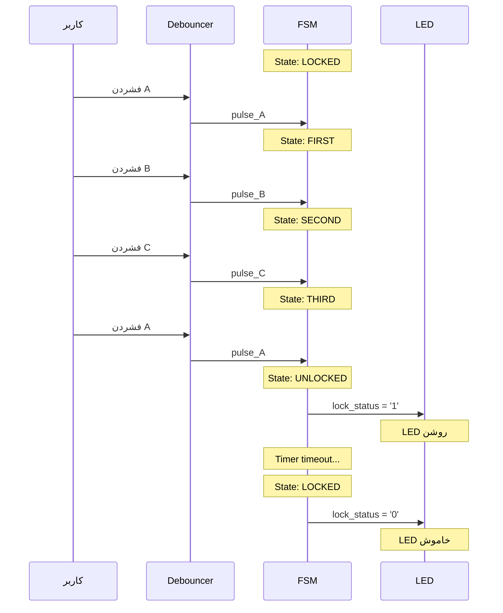

> **[🇬🇧 English Version](README.md)**

# قفل دیجیتال مبتنی بر الگو

یک پیاده‌سازی سخت‌افزاری از قفل دیجیتال مبتنی بر الگو با استفاده از FSM (Finite State Machine) در VHDL. این قفل نیاز به یک توالی خاص ۴ دکمه‌ای (A → B → C → A) برای باز شدن دارد و دارای قابلیت‌های auto-lock، button debouncing و مدیریت جامع خطا است.

<details>
<summary>VHDL چیست؟</summary>

VHDL (زبان توصیف سخت‌افزار VHSIC) یک زبان برنامه‌نویسی برای توصیف مدارهای دیجیتال است. برخلاف نرم‌افزار که روی پردازنده اجرا می‌شود، کد VHDL سخت‌افزار واقعی را توصیف می‌کند که به chip‌ها (FPGA یا ASIC) تبدیل می‌شود. آن را مانند نقشه‌ای برای مدارهای الکترونیکی در نظر بگیرید.

</details>

---

## فهرست مطالب

- [ویژگی‌ها](#ویژگیها)
- [شروع سریع](#شروع-سریع)
- [ساختار پروژه](#ساختار-پروژه)
- [نحوه کارکرد](#نحوه-کارکرد)
- [ساخت و اجرا](#ساخت-و-اجرا)
- [تست](#تست)
- [Synthesis برای FPGA](#synthesis-برای-fpga)
- [مشاهده Waveform](#مشاهده-waveform)
- [عیب‌یابی](#عیبیابی)
- [مستندات](#مستندات)

---

## ویژگی‌ها

- **قفل الگویی امن**: توالی باز کردن ۴ دکمه‌ای (A → B → C → A)
- **Button Debouncing**: فیلتر کردن نوسانات مکانیکی دکمه برای ورودی قابل اعتماد
- **Auto-lock Timer**: قفل شدن خودکار پس از یک بازه زمانی قابل تنظیم
- **محافظت در برابر ورودی اشتباه**: بازگشت به state قفل شده با فشردن دکمه نادرست
- **کاملاً قابل Synthesis**: آماده برای پیاده‌سازی روی FPGA
- **مجموعه تست جامع**: بیش از ۴۴ assertion در ۵ testbench

---

## شروع سریع

### پیش‌نیازها

- **GHDL**: simulator متن‌باز VHDL
- **GTKWave** (اختیاری): waveform viewer برای debugging

<details>
<summary>نصب GHDL و GTKWave روی Ubuntu/Debian</summary>

```bash
sudo apt update
sudo apt install ghdl gtkwave
```

</details>

<details>
<summary>نصب GHDL و GTKWave روی macOS</summary>

```bash
brew install ghdl
brew install --cask gtkwave
```

</details>

<details>
<summary>نصب GHDL و GTKWave روی Windows</summary>

1. دانلود GHDL از: https://github.com/ghdl/ghdl/releases
2. دانلود GTKWave از: https://gtkwave.sourceforge.net/
3. هر دو را به PATH سیستم اضافه کنید

</details>

### اجرای اولین Simulation

**استفاده از script‌ها (پیشنهادی):**

```bash
# رفتن به دایرکتوری پروژه
cd pattern-based-digital-lock

# نصب وابستگی‌ها (فقط بار اول)
./scripts/install.sh

# ساخت و تست
./scripts/build.sh
./scripts/test.sh

# مشاهده waveform‌ها (اختیاری)
./scripts/wave.sh
```

<details>
<summary>دستورات دستی (در صورت تمایل)</summary>

```bash
# کامپایل همه فایل‌های source
ghdl -a --std=08 src/digital_lock.vhd
ghdl -a --std=08 src/button_debouncer.vhd
ghdl -a --std=08 src/top_level.vhd

# کامپایل و اجرای testbench اصلی
ghdl -a --std=08 testbench/tb_digital_lock.vhd
ghdl -e --std=08 tb_digital_lock
ghdl -r --std=08 tb_digital_lock --wave=simulation/tb_digital_lock.ghw

# مشاهده نتایج
gtkwave simulation/tb_digital_lock.ghw
```

</details>

<details>
<summary>معنی دستورات GHDL چیست؟</summary>

- `ghdl -a`: **Analyze** (کامپایل) یک فایل VHDL، بررسی خطاهای نحوی
- `ghdl -e`: **Elaborate** (link) یک design، آماده‌سازی برای simulation
- `ghdl -r`: **Run** simulation
- `--std=08`: استفاده از استاندارد VHDL-2008
- `--wave=file.ghw`: ذخیره waveform‌های signal در یک فایل برای مشاهده

</details>

---

## ساختار پروژه

```
pattern-based-digital-lock/
├── README.md                 # این فایل
├── README-fa.md              # نسخه فارسی
├── PRD.md                    # سند نیازمندی‌های محصول
├── scripts/                  # script‌های اتوماسیون
│   ├── README.md
│   ├── install.sh            # نصب وابستگی‌ها
│   ├── build.sh              # کامپایل فایل‌های source
│   ├── test.sh               # اجرای testbench‌ها
│   ├── synth.sh              # بررسی قابلیت synthesis
│   ├── wave.sh               # باز کردن waveform viewer
│   └── clean.sh              # حذف فایل‌های تولید شده
├── src/                      # فایل‌های source VHDL
│   ├── README.md
│   ├── digital_lock.vhd      # FSM controller اصلی
│   ├── button_debouncer.vhd  # مدار button debouncer
│   └── top_level.vhd         # یکپارچه‌سازی سیستم
├── testbench/                # فایل‌های تست
│   ├── README.md
│   ├── tb_digital_lock.vhd   # تست‌های واحد FSM
│   ├── tb_top_level.vhd      # تست‌های کامل سیستم
│   ├── tb_fsm_coverage.vhd   # تست‌های state coverage
│   ├── tb_edge_cases.vhd     # تست‌های edge case
│   └── tb_debouncer.vhd      # تست‌های واحد debouncer
├── simulation/               # خروجی‌های simulation
│   ├── README.md
│   └── *.ghw                 # فایل‌های waveform
├── synthesis/                # خروجی‌های synthesis
│   └── README.md
└── docs/                     # مستندات تفصیلی
    ├── digital_lock.md
    ├── button_debouncer.md
    ├── top_level.md
    └── testbenches.md
```

---

## نحوه کارکرد

### نمای کلی FSM

قفل به صورت یک FSM پنج state‌ای کار می‌کند:


<details>
<summary>نمودار متنی (اگر Mermaid رندر نمی‌شود)</summary>

```
                    ┌──────────────────────────────────────────┐
                    │                                          │
                    ▼                                          │
    ┌─────────┐    A    ┌─────────┐    B    ┌─────────┐    C    ┌─────────┐    A    ┌──────────┐
    │ LOCKED  │────────▶│ FIRST   │────────▶│ SECOND  │────────▶│ THIRD   │────────▶│ UNLOCKED │
    └─────────┘         └─────────┘         └─────────┘         └─────────┘         └──────────┘
         ▲                   │                   │                   │                    │
         │                   │ دکمه              │ دکمه              │ دکمه               │ Timeout
         │                   │ اشتباه            │ اشتباه            │ اشتباه             │
         └───────────────────┴───────────────────┴───────────────────┴────────────────────┘
```

</details>

<details>
<summary>درک FSM‌ها</summary>

یک FSM (Finite State Machine) مانند یک flowchart است که سخت‌افزار از آن پیروی می‌کند:

1. **State‌ها**: حالت‌های مختلفی که سیستم می‌تواند در آن باشد (LOCKED، FIRST، SECOND و غیره)
2. **Transition‌ها**: قوانین حرکت بین state‌ها (مثلاً "اگر دکمه A فشرده شد، به FIRST برو")
3. **Output‌ها**: کاری که سیستم در هر state انجام می‌دهد (مثلاً lock_status = '0' در LOCKED)

قفل از state LOCKED شروع می‌شود و فقط با فشردن دکمه‌ها به ترتیب دقیق A → B → C → A به state UNLOCKED می‌رسد

</details>

### توالی باز کردن



| مرحله | فشردن | State فعلی | State بعدی |
|-------|-------|-----------|-----------|
| ۱     | A     | LOCKED    | FIRST     |
| ۲     | B     | FIRST     | SECOND    |
| ۳     | C     | SECOND    | THIRD     |
| ۴     | A     | THIRD     | UNLOCKED  |

### مدیریت خطا

- **دکمه اشتباه**: بازگشت فوری به state LOCKED
- **Reset signal**: بازگشت به LOCKED از هر state‌ای
- **Timeout**: auto-lock پس از زمان قابل تنظیم (پیش‌فرض: ۵ clock cycle در simulation)

---

## ساخت و اجرا

### استفاده از Script‌ها (پیشنهادی)

```bash
# ساخت همه فایل‌های source
./scripts/build.sh

# اجرای همه تست‌ها
./scripts/test.sh

# اجرای یک تست خاص
./scripts/test.sh tb_digital_lock

# اجرای تست‌ها بدون تولید waveform (سریع‌تر)
./scripts/test.sh --no-wave

# مشاهده waveform‌ها
./scripts/wave.sh tb_digital_lock

# پاک‌سازی build artifact‌ها
./scripts/clean.sh
```

<details>
<summary>دستورات کامپایل دستی</summary>

```bash
# Analyze (کامپایل) فایل‌های source به ترتیب dependency
ghdl -a --std=08 src/digital_lock.vhd
ghdl -a --std=08 src/button_debouncer.vhd
ghdl -a --std=08 src/top_level.vhd

# Analyze testbench‌ها
ghdl -a --std=08 testbench/tb_digital_lock.vhd
ghdl -a --std=08 testbench/tb_top_level.vhd
ghdl -a --std=08 testbench/tb_fsm_coverage.vhd
ghdl -a --std=08 testbench/tb_edge_cases.vhd
ghdl -a --std=08 testbench/tb_debouncer.vhd

# Elaborate و run
ghdl -e --std=08 tb_digital_lock
ghdl -r --std=08 tb_digital_lock --wave=simulation/tb_digital_lock.ghw
```

</details>

<details>
<summary>چرا ترتیب کامپایل مهم است؟</summary>

فایل‌های VHDL باید به ترتیب dependency کامپایل شوند:
1. `digital_lock.vhd` - بدون dependency
2. `button_debouncer.vhd` - بدون dependency
3. `top_level.vhd` - وابسته به هر دو بالا
4. Testbench‌ها - وابسته به component‌هایی که تست می‌کنند

اگر به ترتیب نادرست کامپایل کنید، خطای "component not found" دریافت خواهید کرد.

</details>

---

## تست

### مجموعه‌های تست

| Testbench | هدف | تست‌ها |
|---------|-----|--------|
| `tb_digital_lock` | عملکرد اصلی FSM | ۶ test case |
| `tb_top_level` | سیستم کامل با debouncing | ۱۱ test case |
| `tb_fsm_coverage` | ۱۰۰٪ state coverage | همه state‌ها و transition‌ها |
| `tb_edge_cases` | Edge case‌ها | ۲۲ assertion |
| `tb_debouncer` | تست واحد debouncer | ۴ test case |

### خروجی مورد انتظار

یک اجرای تست موفق نشان می‌دهد:
```
=== Starting Digital Lock Testbench ===
TC1: Testing reset functionality
TC1 PASSED: Reset works correctly
TC2: Testing correct sequence A->B->C->A
TC2 PASSED: Correct sequence unlocks the system
...
=== All Test Cases Completed ===
=== Digital Lock Testbench PASSED ===
```

<details>
<summary>درک خروجی تست</summary>

- **note**: پیام‌های اطلاعاتی (پیشرفت تست)
- **warning**: مسائل غیر بحرانی
- **error**: شکست تست (assertion‌هایی که fail شدند)
- **failure**: خطاهای fatal (simulation متوقف می‌شود)

اگر "PASSED" را در انتها می‌بینید، همه تست‌ها موفق بوده‌اند!

</details>

### جزئیات Test Case‌ها

**TC1 - تست Reset**: تأیید می‌کند سیستم پس از reset در state LOCKED شروع می‌شود

**TC2 - توالی صحیح**: تست می‌کند A→B→C→A سیستم را unlock می‌کند

**TC3 - توالی اشتباه**: تست می‌کند A→B→D سیستم را locked نگه می‌دارد

**TC4 - دکمه اول اشتباه**: تست بازیابی پس از فشردن B اول

**TC5 - Auto-lock**: تست قفل شدن خودکار پس از timeout

**TC6 - Reset حین توالی**: تست می‌کند reset پیشرفت جزئی را پاک می‌کند

---

## Synthesis برای FPGA

### بررسی قابلیت Synthesis

```bash
# استفاده از script (پیشنهادی)
./scripts/synth.sh

# یا به صورت دستی
ghdl -a --std=08 src/digital_lock.vhd
ghdl -a --std=08 src/button_debouncer.vhd
ghdl -a --std=08 src/top_level.vhd
ghdl --synth --std=08 top_level
```

<details>
<summary>Synthesis چیست؟</summary>

**Synthesis** کد VHDL را به سخت‌افزار واقعی تبدیل می‌کند:
1. کد VHDL شما توصیف می‌کند مدار *چه کاری* باید انجام دهد
2. ابزار synthesis می‌فهمد *چگونه* آن را با logic gate‌ها بسازد
3. نتیجه یک "netlist" است که می‌تواند روی FPGA بارگذاری شود

همه کدهای VHDL قابل synthesis نیستند - ساختارهای simulation-only مانند `wait for 10 ns` در simulation کار می‌کنند اما نمی‌توانند سخت‌افزار واقعی شوند.

</details>

### برای Xilinx Vivado

1. یک پروژه جدید در Vivado ایجاد کنید
2. همه فایل‌ها از دایرکتوری `src/` را اضافه کنید
3. `top_level` را به عنوان top module تنظیم کنید
4. Pin‌های I/O را برای برد FPGA خود پیکربندی کنید
5. Synthesis → Implementation → Generate Bitstream را اجرا کنید

### پیکربندی برای سخت‌افزار واقعی

برای استفاده واقعی، این generic parameter‌ها را در `top_level.vhd` تنظیم کنید:

```vhdl
-- برای clock 100 مگاهرتز و زمان debounce ~20ms:
DEBOUNCE_TIME => 2_000_000

-- برای clock 100 مگاهرتز و زمان باز بودن ~5 ثانیه:
UNLOCK_TIME => 500_000_000
```

<details>
<summary>محاسبه مقادیر زمانی</summary>

فرمول: `مقدار = زمان_به_ثانیه × clock_frequency`

مثال‌ها برای clock 100 مگاهرتز (100,000,000 هرتز):
- debounce 20 میلی‌ثانیه: 0.020 × 100,000,000 = 2,000,000
- unlock time 5 ثانیه: 5 × 100,000,000 = 500,000,000

برای simulation، از مقادیر کوچک (5-10) استفاده می‌کنیم تا simulation‌ها سریع باشند.

</details>

---

## مشاهده Waveform

### باز کردن Waveform‌ها در GTKWave

```bash
gtkwave simulation/tb_digital_lock.ghw
```

### Signal‌های کلیدی برای مشاهده

| Signal | توضیحات |
|--------|---------|
| `clk` | System clock |
| `reset` | Reset فعال-بالا |
| `button_A/B/C/D` | ورودی‌های دکمه |
| `lock_status` | خروجی: '1' = unlocked، '0' = locked |
| `current_state` | State داخلی FSM |
| `unlock_timer` | مقدار countdown timer |

<details>
<summary>نکات GTKWave برای مبتدیان</summary>

1. **افزودن signal‌ها**: در پنل چپ، hierarchy را باز کنید و روی نام signal‌ها دوبار کلیک کنید
2. **Zoom**: از چرخ ماوس یا منوی View → Zoom استفاده کنید
3. **Navigate**: هر جای timeline کلیک کنید تا cursor را جابجا کنید
4. **Marker‌ها**: 'M' را فشار دهید تا یک marker در موقعیت cursor بگذارید
5. **ذخیره layout**: File → Write Save File (انتخاب signal شما را ذخیره می‌کند)

</details>

---

## عیب‌یابی

### خطاهای رایج

**"cannot find entity"**
```
error: cannot find entity work.digital_lock
```
*راه‌حل*: فایل‌های source را قبل از testbench‌ها کامپایل کنید.

**"assertion failure"**
```
assertion failure: TC2 FAILED: Lock should be UNLOCKED after correct sequence!
```
*راه‌حل*: بررسی کنید button press‌ها single-cycle pulse باشند. FSM ورودی‌های edge-detected انتظار دارد.

**"multiple drivers"**
```
error: signal has multiple drivers
```
*راه‌حل*: فقط یک process باید به هر signal مقدار دهد. تخصیص‌های تکراری را بررسی کنید.

<details>
<summary>نکات عمومی Debugging</summary>

1. **Waveform‌ها را بررسی کنید**: فایل .ghw را در GTKWave باز کنید تا دقیقاً چه اتفاقی افتاده ببینید
2. **عبارات report اضافه کنید**: `report "Debug: got here";` را در کد VHDL خود قرار دهید
3. **ساده کنید**: هر بار یک component را تست کنید
4. **Timing را بررسی کنید**: مطمئن شوید عبارات wait زمان کافی برای signal propagation می‌دهند

</details>

### دریافت کمک

1. [مستندات تفصیلی](docs/) را برای هر component بررسی کنید
2. کد testbench را برای مثال‌های استفاده مرور کنید
3. Waveform‌ها را برای درک signal behavior بررسی کنید

---

## مستندات

مستندات تفصیلی برای هر component در دایرکتوری [docs/](docs/) موجود است:

- [digital_lock.md](docs/digital_lock.md) - معماری و پیاده‌سازی FSM controller
- [button_debouncer.md](docs/button_debouncer.md) - طراحی مدار debouncer
- [top_level.md](docs/top_level.md) - یکپارچه‌سازی سیستم و configuration
- [testbenches.md](docs/testbenches.md) - مستندات test suite

### مرجع Script‌ها

Script‌های اتوماسیون در [scripts/](scripts/):

| Script | توضیحات |
|---------|---------|
| `install.sh` | نصب GHDL و GTKWave |
| `build.sh` | کامپایل فایل‌های source |
| `test.sh` | اجرای testbench‌ها |
| `synth.sh` | بررسی قابلیت synthesis |
| `wave.sh` | باز کردن waveform viewer |
| `clean.sh` | حذف فایل‌های تولید شده |

---

## مجوز

این پروژه برای اهداف آموزشی ارائه شده است.

---

## قدردانی

به عنوان بخشی از پروژه درس CAD (طراحی به کمک کامپیوتر) توسعه یافته است و نشان‌دهنده:
- طراحی FSM (Finite State Machine)
- بهترین شیوه‌های کدنویسی VHDL
- روش‌شناسی Hardware Verification
- طراحی دیجیتال قابل Synthesis
