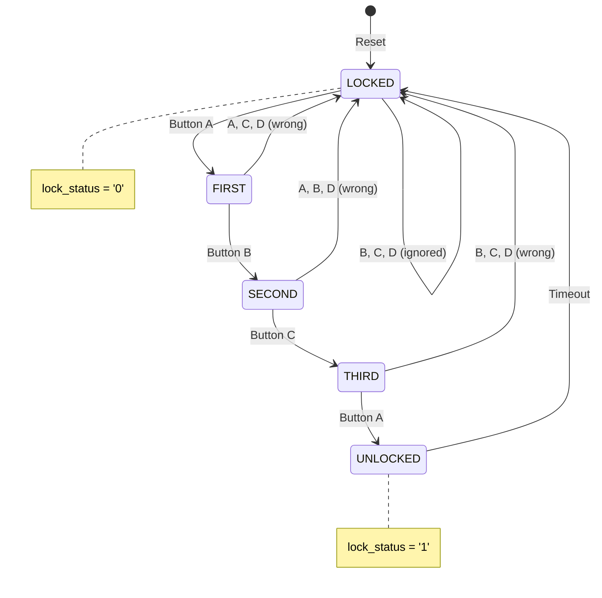
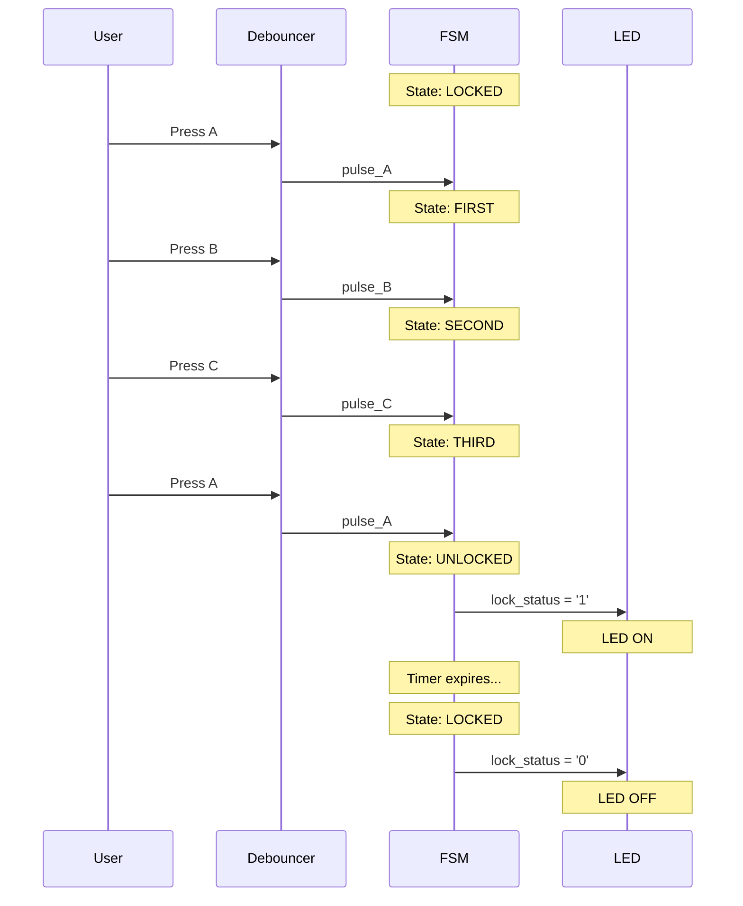

> **[🇮🇷 نسخه فارسی](README-fa.md)**

# Pattern-Based Digital Lock

A hardware implementation of a pattern-based digital lock using a Finite State Machine (FSM) in VHDL. The lock requires a specific 4-button sequence (A → B → C → A) to unlock and features automatic re-locking, button debouncing, and comprehensive error handling.

<details>
<summary>What is VHDL?</summary>

VHDL (VHSIC Hardware Description Language) is a programming language used to describe digital circuits. Unlike software that runs on a processor, VHDL code describes actual hardware that gets manufactured into chips (FPGAs or ASICs). Think of it as a blueprint for electronic circuits.

</details>

---

## Table of Contents

- [Features](#features)
- [Quick Start](#quick-start)
- [Project Structure](#project-structure)
- [How It Works](#how-it-works)
- [Building and Running](#building-and-running)
- [Testing](#testing)
- [Synthesis for FPGA](#synthesis-for-fpga)
- [Waveform Viewing](#waveform-viewing)
- [Troubleshooting](#troubleshooting)
- [Documentation](#documentation)

---

## Features

- **Secure Pattern Lock**: 4-button unlock sequence (A → B → C → A)
- **Button Debouncing**: Filters mechanical button bounce for reliable input
- **Auto-Relock Timer**: Automatically locks after a configurable timeout
- **Wrong Input Protection**: Returns to locked state on incorrect button press
- **Fully Synthesizable**: Ready for FPGA deployment
- **Comprehensive Test Suite**: 44+ test assertions across 5 testbenches

---

## Quick Start

### Prerequisites

- **GHDL**: Open-source VHDL simulator
- **GTKWave** (optional): Waveform viewer for debugging

<details>
<summary>Installing GHDL and GTKWave on Ubuntu/Debian</summary>

```bash
sudo apt update
sudo apt install ghdl gtkwave
```

</details>

<details>
<summary>Installing GHDL and GTKWave on macOS</summary>

```bash
brew install ghdl
brew install --cask gtkwave
```

</details>

<details>
<summary>Installing GHDL and GTKWave on Windows</summary>

1. Download GHDL from: https://github.com/ghdl/ghdl/releases
2. Download GTKWave from: https://gtkwave.sourceforge.net/
3. Add both to your system PATH

</details>

### Run Your First Simulation

**Using Scripts (Recommended):**

```bash
# Navigate to project directory
cd pattern-based-digital-lock

# Install dependencies (first time only)
./scripts/install.sh

# Build and test
./scripts/build.sh
./scripts/test.sh

# View waveforms (optional)
./scripts/wave.sh
```

<details>
<summary>Manual commands (if you prefer)</summary>

```bash
# Compile all source files
ghdl -a --std=08 src/digital_lock.vhd
ghdl -a --std=08 src/button_debouncer.vhd
ghdl -a --std=08 src/top_level.vhd

# Compile and run the main testbench
ghdl -a --std=08 testbench/tb_digital_lock.vhd
ghdl -e --std=08 tb_digital_lock
ghdl -r --std=08 tb_digital_lock --wave=simulation/tb_digital_lock.ghw

# View results
gtkwave simulation/tb_digital_lock.ghw
```

</details>

<details>
<summary>What do the GHDL commands mean?</summary>

- `ghdl -a`: **Analyze** (compile) a VHDL file, checking for syntax errors
- `ghdl -e`: **Elaborate** (link) a design, preparing it for simulation
- `ghdl -r`: **Run** the simulation
- `--std=08`: Use VHDL-2008 standard
- `--wave=file.ghw`: Save signal waveforms to a file for viewing

</details>

---

## Project Structure

```
pattern-based-digital-lock/
├── README.md                 # This file
├── PRD.md                    # Product Requirements Document
├── scripts/                  # Automation scripts
│   ├── README.md
│   ├── install.sh            # Install dependencies
│   ├── build.sh              # Compile source files
│   ├── test.sh               # Run testbenches
│   ├── synth.sh              # Check synthesizability
│   ├── wave.sh               # Open waveform viewer
│   └── clean.sh              # Remove generated files
├── src/                      # Source VHDL files
│   ├── README.md
│   ├── digital_lock.vhd      # Main FSM controller
│   ├── button_debouncer.vhd  # Button debounce circuit
│   └── top_level.vhd         # System integration
├── testbench/                # Test files
│   ├── README.md
│   ├── tb_digital_lock.vhd   # FSM unit tests
│   ├── tb_top_level.vhd      # Full system tests
│   ├── tb_fsm_coverage.vhd   # State coverage tests
│   ├── tb_edge_cases.vhd     # Edge case tests
│   └── tb_debouncer.vhd      # Debouncer unit tests
├── simulation/               # Simulation outputs
│   ├── README.md
│   └── *.ghw                 # Waveform files
├── synthesis/                # Synthesis outputs
│   └── README.md
└── docs/                     # Detailed documentation
    ├── digital_lock.md
    ├── button_debouncer.md
    ├── top_level.md
    └── testbenches.md
```

---

## How It Works

### State Machine Overview

The lock operates as a 5-state Finite State Machine:



<details>
<summary>Text-based diagram (if Mermaid doesn't render)</summary>

```
                    ┌──────────────────────────────────────────┐
                    │                                          │
                    ▼                                          │
    ┌─────────┐    A    ┌─────────┐    B    ┌─────────┐    C    ┌─────────┐    A    ┌──────────┐
    │ LOCKED  │────────▶│ FIRST   │────────▶│ SECOND  │────────▶│ THIRD   │────────▶│ UNLOCKED │
    └─────────┘         └─────────┘         └─────────┘         └─────────┘         └──────────┘
         ▲                   │                   │                   │                    │
         │                   │ Wrong             │ Wrong             │ Wrong              │ Timeout
         │                   │ Button            │ Button            │ Button             │
         └───────────────────┴───────────────────┴───────────────────┴────────────────────┘
```

</details>

<details>
<summary>Understanding State Machines</summary>

A Finite State Machine (FSM) is like a flowchart that the hardware follows:

1. **States**: Different "modes" the system can be in (LOCKED, FIRST, SECOND, etc.)
2. **Transitions**: Rules for moving between states (e.g., "if button A is pressed, go to FIRST")
3. **Outputs**: What the system does in each state (e.g., lock_status = '0' in LOCKED)

The lock starts in LOCKED state and only reaches UNLOCKED by pressing buttons in the exact sequence: A → B → C → A

</details>

### Unlock Sequence



| Step | Press | Current State | Next State |
|------|-------|---------------|------------|
| 1    | A     | LOCKED        | FIRST      |
| 2    | B     | FIRST         | SECOND     |
| 3    | C     | SECOND        | THIRD      |
| 4    | A     | THIRD         | UNLOCKED   |

### Error Handling

- **Wrong button**: Returns immediately to LOCKED state
- **Reset signal**: Returns to LOCKED from any state
- **Timeout**: Auto-relocks after configurable time (default: 5 clock cycles in simulation)

---

## Building and Running

### Using Scripts (Recommended)

```bash
# Build all source files
./scripts/build.sh

# Run all tests
./scripts/test.sh

# Run a specific test
./scripts/test.sh tb_digital_lock

# Run tests without waveform generation (faster)
./scripts/test.sh --no-wave

# View waveforms
./scripts/wave.sh tb_digital_lock

# Clean build artifacts
./scripts/clean.sh
```

<details>
<summary>Manual compilation commands</summary>

```bash
# Analyze (compile) source files in dependency order
ghdl -a --std=08 src/digital_lock.vhd
ghdl -a --std=08 src/button_debouncer.vhd
ghdl -a --std=08 src/top_level.vhd

# Analyze testbenches
ghdl -a --std=08 testbench/tb_digital_lock.vhd
ghdl -a --std=08 testbench/tb_top_level.vhd
ghdl -a --std=08 testbench/tb_fsm_coverage.vhd
ghdl -a --std=08 testbench/tb_edge_cases.vhd
ghdl -a --std=08 testbench/tb_debouncer.vhd

# Elaborate and run
ghdl -e --std=08 tb_digital_lock
ghdl -r --std=08 tb_digital_lock --wave=simulation/tb_digital_lock.ghw
```

</details>

<details>
<summary>Why compile in this order?</summary>

VHDL files must be compiled in dependency order:
1. `digital_lock.vhd` - No dependencies
2. `button_debouncer.vhd` - No dependencies
3. `top_level.vhd` - Depends on both above
4. Testbenches - Depend on the components they test

If you compile out of order, you'll get "component not found" errors.

</details>

---

## Testing

### Test Suites

| Testbench | Purpose | Tests |
|-----------|---------|-------|
| `tb_digital_lock` | Core FSM functionality | 6 test cases |
| `tb_top_level` | Full system with debouncing | 11 test cases |
| `tb_fsm_coverage` | 100% state coverage | All states & transitions |
| `tb_edge_cases` | Boundary conditions | 22 assertions |
| `tb_debouncer` | Debouncer unit test | 4 test cases |

### Expected Output

A successful test run shows:
```
=== Starting Digital Lock Testbench ===
TC1: Testing reset functionality
TC1 PASSED: Reset works correctly
TC2: Testing correct sequence A->B->C->A
TC2 PASSED: Correct sequence unlocks the system
...
=== All Test Cases Completed ===
=== Digital Lock Testbench PASSED ===
```

<details>
<summary>Understanding test output</summary>

- **note**: Informational messages (test progress)
- **warning**: Non-critical issues
- **error**: Test failures (assertions that failed)
- **failure**: Fatal errors (simulation stops)

If you see "PASSED" at the end, all tests succeeded!

</details>

### Test Case Details

**TC1 - Reset Test**: Verifies system starts in LOCKED state after reset

**TC2 - Correct Sequence**: Tests A→B→C→A unlocks the system

**TC3 - Wrong Sequence**: Tests A→B→D keeps system locked

**TC4 - Wrong First Button**: Tests recovery after pressing B first

**TC5 - Auto-Relock**: Tests automatic re-locking after timeout

**TC6 - Reset During Sequence**: Tests reset clears partial progress

---

## Synthesis for FPGA

### Check Synthesizability

```bash
# Using script (recommended)
./scripts/synth.sh

# Or manually
ghdl -a --std=08 src/digital_lock.vhd
ghdl -a --std=08 src/button_debouncer.vhd
ghdl -a --std=08 src/top_level.vhd
ghdl --synth --std=08 top_level
```

<details>
<summary>What is synthesis?</summary>

**Synthesis** converts VHDL code into actual hardware:
1. Your VHDL code describes *what* the circuit should do
2. The synthesis tool figures out *how* to build it with logic gates
3. The result is a "netlist" that can be loaded onto an FPGA

Not all VHDL code is synthesizable - simulation-only constructs like `wait for 10 ns` work in simulation but can't become real hardware.

</details>

### For Xilinx Vivado

1. Create a new project in Vivado
2. Add all files from `src/` directory
3. Set `top_level` as the top module
4. Configure I/O pins for your FPGA board
5. Run Synthesis → Implementation → Generate Bitstream

### Configuring for Real Hardware

For real-world use, adjust these generic parameters in `top_level.vhd`:

```vhdl
-- For 100 MHz clock and ~20ms debounce time:
DEBOUNCE_TIME => 2_000_000

-- For 100 MHz clock and ~5 second unlock time:
UNLOCK_TIME => 500_000_000
```

<details>
<summary>Calculating timing values</summary>

The formula is: `value = time_in_seconds × clock_frequency`

Examples for 100 MHz (100,000,000 Hz) clock:
- 20ms debounce: 0.020 × 100,000,000 = 2,000,000
- 5 second unlock: 5 × 100,000,000 = 500,000,000

For simulation, we use small values (5-10) to keep simulations fast.

</details>

---

## Waveform Viewing

### Open Waveforms in GTKWave

```bash
gtkwave simulation/tb_digital_lock.ghw
```

### Key Signals to Observe

| Signal | Description |
|--------|-------------|
| `clk` | System clock |
| `reset` | Active-high reset |
| `button_A/B/C/D` | Button inputs |
| `lock_status` | Output: '1' = unlocked, '0' = locked |
| `current_state` | Internal FSM state |
| `unlock_timer` | Countdown timer value |

<details>
<summary>GTKWave tips for beginners</summary>

1. **Add signals**: In the left panel, expand the hierarchy and double-click signals to add them
2. **Zoom**: Use mouse wheel or View → Zoom menu
3. **Navigate**: Click anywhere on the timeline to move the cursor
4. **Markers**: Press 'M' to drop a marker at the cursor position
5. **Save layout**: File → Write Save File (saves your signal selection)

</details>

---

## Troubleshooting

### Common Errors

**"cannot find entity"**
```
error: cannot find entity work.digital_lock
```
*Solution*: Compile source files before testbenches. See [Build Order](#compile-all-files).

**"assertion failure"**
```
assertion failure: TC2 FAILED: Lock should be UNLOCKED after correct sequence!
```
*Solution*: Check that button presses are single-cycle pulses. The FSM expects edge-detected inputs.

**"multiple drivers"**
```
error: signal has multiple drivers
```
*Solution*: Only one process should assign to each signal. Check for duplicate assignments.

<details>
<summary>General debugging tips</summary>

1. **Check waveforms**: Open the .ghw file in GTKWave to see exactly what happened
2. **Add report statements**: Insert `report "Debug: got here";` in your VHDL code
3. **Simplify**: Test one component at a time
4. **Check timing**: Ensure your wait statements give enough time for signals to propagate

</details>

### Getting Help

1. Check the [detailed documentation](docs/) for each component
2. Review the testbench code for usage examples
3. Examine waveforms to understand signal behavior

---

## Documentation

Detailed documentation for each component is available in the [docs/](docs/) directory:

- [digital_lock.md](docs/digital_lock.md) - FSM controller architecture and implementation
- [button_debouncer.md](docs/button_debouncer.md) - Debounce circuit design
- [top_level.md](docs/top_level.md) - System integration and configuration
- [testbenches.md](docs/testbenches.md) - Test suite documentation

### Scripts Reference

Automation scripts are in [scripts/](scripts/):

| Script | Description |
|--------|-------------|
| `install.sh` | Install GHDL and GTKWave |
| `build.sh` | Compile source files |
| `test.sh` | Run testbenches |
| `synth.sh` | Check synthesizability |
| `wave.sh` | Open waveform viewer |
| `clean.sh` | Remove generated files |

---

## License

This project is provided for educational purposes.

---

## Acknowledgments

Developed as part of a CAD (Computer-Aided Design) course project demonstrating:
- Finite State Machine design
- VHDL coding best practices
- Hardware verification methodology
- Synthesizable digital design
