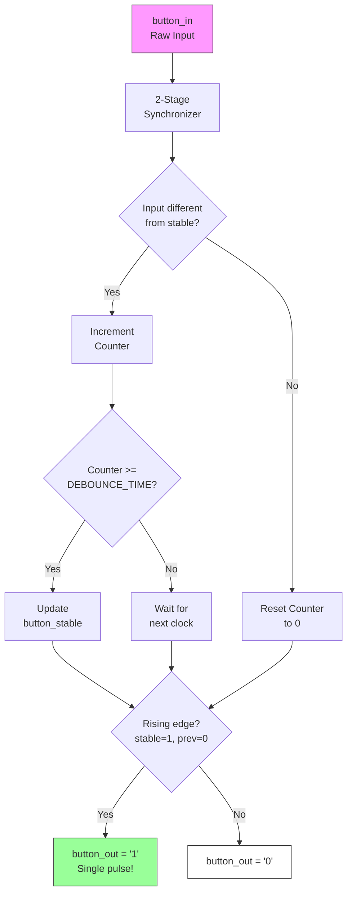

# Button Debouncer Module

**File**: `src/button_debouncer.vhd`
**Lines**: 93
**Purpose**: Filters mechanical button bounce and provides clean, single-cycle output pulses

---

## Table of Contents

- [Overview](#overview)
- [The Problem: Button Bounce](#the-problem-button-bounce)
- [Entity Interface](#entity-interface)
- [Architecture](#architecture)
- [How It Works](#how-it-works)
- [Usage Example](#usage-example)
- [Timing Diagram](#timing-diagram)
- [Configuration](#configuration)
- [Design Decisions](#design-decisions)

---

## Overview

The `button_debouncer` module solves two critical problems with mechanical buttons:

1. **Bounce filtering**: Ignores rapid on/off transitions from mechanical contact bounce
2. **Edge detection**: Produces exactly one output pulse per button press, regardless of how long the button is held

<details>
<summary>Why do we need debouncing?</summary>

When you press a physical button, the metal contacts don't make a clean connection. They "bounce" - rapidly connecting and disconnecting for a few milliseconds before settling. Without debouncing, one button press might register as 10-50 rapid presses!

</details>

---

## The Problem: Button Bounce

### Raw Button Signal (Bouncy)

```
Button Press Event:

Physical    ____________________/‾‾‾‾‾‾‾‾‾‾‾‾‾‾‾‾‾‾‾‾‾‾‾‾‾‾‾‾‾‾‾\____
Action          ↑                                                ↑
             Press                                           Release

Raw         ____/‾\_/‾‾\_/‾‾‾‾\__/‾‾‾‾‾‾‾‾‾‾‾‾‾‾‾‾‾‾‾\_/‾‾\_/‾\_____
Signal           ↑                                    ↑
              Bouncing                             Bouncing
             (5-20ms)                              (5-20ms)
```

### What the FSM Would See Without Debouncing

Without debouncing, the FSM would see multiple button presses:
- User presses A once → FSM sees A pressed 5-10 times
- User presses A, B, C, A → FSM sees A, A, A, B, B, C, C, A, A, A
- Result: Unpredictable behavior, unlock sequence impossible to enter

### Solution: Debounced and Edge-Detected Output

```
Debounced   ________________________________/‾‾‾‾‾‾‾‾‾‾‾‾‾‾‾‾‾‾‾‾\______
(Stable)

Output      ________________________________/‾\__________________________
(Pulse)                                      ↑
                                   Single-cycle pulse
```

---

## Entity Interface

```vhdl
entity button_debouncer is
    Generic (
        DEBOUNCE_TIME : integer := 10
    );
    Port (
        clk        : in  std_logic;
        reset      : in  std_logic;
        button_in  : in  std_logic;
        button_out : out std_logic
    );
end button_debouncer;
```

### Generic Parameters

| Parameter | Type | Default | Description |
|-----------|------|---------|-------------|
| `DEBOUNCE_TIME` | integer | 10 | Clock cycles for stability |

<details>
<summary>How to calculate DEBOUNCE_TIME</summary>

Formula: `DEBOUNCE_TIME = debounce_period × clock_frequency`

Examples:
- 10ms debounce at 100 MHz: 0.010 × 100,000,000 = 1,000,000
- 20ms debounce at 50 MHz: 0.020 × 50,000,000 = 1,000,000

For simulation, use small values (10-100) to keep simulations fast.

Typical real-world values: 10-20ms (1-2 million cycles at 100 MHz)

</details>

### Ports

| Port | Direction | Type | Description |
|------|-----------|------|-------------|
| `clk` | in | std_logic | System clock |
| `reset` | in | std_logic | Asynchronous reset, active-high |
| `button_in` | in | std_logic | Raw button input (may bounce) |
| `button_out` | out | std_logic | Clean, single-cycle pulse output |

---

## Architecture

### Internal Signals

```vhdl
signal counter       : integer range 0 to DEBOUNCE_TIME := 0;
signal button_sync   : std_logic_vector(1 downto 0) := "00";
signal button_stable : std_logic := '0';
signal button_prev   : std_logic := '0';
```

| Signal | Type | Description |
|--------|------|-------------|
| `counter` | integer | Stability counter (counts up while input is stable) |
| `button_sync` | std_logic_vector(1:0) | 2-stage synchronizer for metastability |
| `button_stable` | std_logic | Debounced button state |
| `button_prev` | std_logic | Previous stable state (for edge detection) |

<details>
<summary>What is metastability?</summary>

**Metastability** occurs when a signal changes exactly as the clock edge arrives. The flip-flop can't decide between 0 and 1, producing an unstable output.

A **synchronizer** (two flip-flops in series) gives the signal two clock cycles to stabilize before being used, virtually eliminating metastability issues.

```
button_in → [FF1] → [FF2] → button_sync(0)
             ↑        ↑
          May be    Stable
         unstable
```

</details>

---

## How It Works

### Processing Flow



<details>
<summary>Text description of the flow</summary>

1. Raw button input enters the synchronizer
2. Synchronized input is compared to current stable value
3. If different, counter increments; if same, counter resets
4. When counter reaches DEBOUNCE_TIME, stable value updates
5. Edge detector compares current stable to previous stable
6. Output pulse generated only on rising edge (0→1 transition)

</details>

### Step 1: Synchronization

```vhdl
-- Two-stage synchronizer for metastability protection
button_sync <= button_sync(0) & button_in;
```

The raw button input passes through two flip-flops to prevent metastability from affecting downstream logic.

### Step 2: Debounce Counting

```vhdl
-- Count stability time
if button_sync(1) /= button_stable then
    -- Input changed, start counting
    if counter >= DEBOUNCE_TIME then
        button_stable <= button_sync(1);  -- Accept new value
        counter <= 0;
    else
        counter <= counter + 1;  -- Keep counting
    end if;
else
    counter <= 0;  -- Input matches stable, reset counter
end if;
```

The counter only increments when the input differs from the stable output. If the input stays different for `DEBOUNCE_TIME` cycles, it's accepted as the new stable value.

### Step 3: Edge Detection

```vhdl
-- Remember previous stable state
button_prev <= button_stable;

-- Generate pulse on rising edge
if button_stable = '1' and button_prev = '0' then
    button_out <= '1';  -- Rising edge detected!
else
    button_out <= '0';
end if;
```

By comparing current stable state with previous stable state, we detect the exact moment the button transitions from unpressed to pressed.

<details>
<summary>Why rising edge detection?</summary>

Without edge detection, holding a button would continuously output '1'. The FSM would see the same button pressed every clock cycle, advancing through states too fast.

With edge detection:
- Press and hold button A → ONE pulse generated
- Release button A → No pulse
- Press button A again → ONE pulse generated

This ensures each physical press = exactly one FSM transition.

</details>

---

## Usage Example

### Basic Instantiation

```vhdl
debounce_btn_a: entity work.button_debouncer
    generic map (
        DEBOUNCE_TIME => 1000000  -- ~10ms at 100MHz
    )
    port map (
        clk        => system_clock,
        reset      => system_reset,
        button_in  => raw_button_a,  -- From physical button
        button_out => clean_button_a  -- To FSM
    );
```

### Multiple Buttons

```vhdl
-- Create 4 debounced buttons
gen_debouncers: for i in 0 to 3 generate
    debouncer: entity work.button_debouncer
        generic map (DEBOUNCE_TIME => DEBOUNCE_CYCLES)
        port map (
            clk        => clk,
            reset      => reset,
            button_in  => raw_buttons(i),
            button_out => clean_buttons(i)
        );
end generate;
```

---

## Timing Diagram

### Normal Button Press

```
clk          ─┐ ┌─┐ ┌─┐ ┌─┐ ┌─┐ ┌─┐ ┌─┐ ┌─┐ ┌─┐ ┌─┐ ┌─┐ ┌─┐ ┌─┐ ┌─
              └─┘ └─┘ └─┘ └─┘ └─┘ └─┘ └─┘ └─┘ └─┘ └─┘ └─┘ └─┘ └─┘

button_in    ──────────────┐                       ┌───────────────
(raw)                      └───────────────────────┘

counter           0   1   2   3   4   5   0   0   1   2   3   4   5

button_stable ────────────────────────────┐       ┌────────────────
(debounced)                               └───────┘

button_out   ─────────────────────────────┐ ┌─────────────────────
(pulse)                                   └─┘
                                          ↑
                                   Single-cycle pulse
                                   on rising edge
```

### Bouncy Button Press (Filtered)

```
button_in    ──────┐ ┌─┐ ┌─┐ ┌──────────────────────────────────
(bouncy)           └─┘ └─┘ └─┘
                   ↑       ↑
                Bounces  Settles

counter           0 1 0 1 0 1 2 3 4 5
                  ↑   ↑
               Resets on each bounce

button_stable ────────────────────────────┐
                                          └─ (changes after DEBOUNCE_TIME)

button_out   ─────────────────────────────┐ ┌──
                                          └─┘
```

### Short Press (Filtered Out)

```
button_in    ──────────┐   ┌───────────────────────────────────
(too short)            └───┘
                       ← 3 →  (less than DEBOUNCE_TIME=5)

counter           0   1   2   3   0   0   0
                                  ↑
                           Resets before reaching 5

button_stable ─────────────────────────────────────────────────
                              (never changes)

button_out   ──────────────────────────────────────────────────
                              (no pulse generated)
```

---

## Configuration

### Simulation Settings

```vhdl
-- Fast simulation (not realistic but quick)
DEBOUNCE_TIME => 5
```

### Real Hardware Settings

| Clock Frequency | Debounce Period | DEBOUNCE_TIME |
|-----------------|-----------------|---------------|
| 50 MHz | 10 ms | 500,000 |
| 50 MHz | 20 ms | 1,000,000 |
| 100 MHz | 10 ms | 1,000,000 |
| 100 MHz | 20 ms | 2,000,000 |

<details>
<summary>How to choose debounce period</summary>

Typical mechanical buttons bounce for 5-20ms. Recommendations:

- **10ms**: Good for high-quality buttons, faster response
- **20ms**: Safe for most buttons, slightly slower response
- **50ms**: Very conservative, noticeable delay

Start with 20ms and adjust based on your specific buttons. If you see occasional double-presses, increase the debounce time.

</details>

---

## Design Decisions

### Why a Counter-Based Approach?

Counter-based debouncing is:
- **Simple**: Easy to understand and implement
- **Predictable**: Fixed debounce time, deterministic behavior
- **Resource-efficient**: Just one counter per button
- **Adjustable**: Change timing with a single generic parameter

Alternative approaches (shift registers, analog RC filters) are more complex with no significant benefits for this application.

### Why 2-Stage Synchronization?

A 2-stage synchronizer reduces metastability probability to negligible levels:
- Single flip-flop: ~10% chance of metastable output propagating
- Two flip-flops: ~0.01% chance
- For critical applications, 3 stages can be used

### Why Edge Detection Inside the Debouncer?

Integrating edge detection into the debouncer:
- Reduces external component count
- Ensures output is always a clean single pulse
- Simplifies the FSM (no edge detection logic needed)
- Matches what the FSM expects (one pulse per press)

### Why Not Use Separate Debounce and Edge Detection Modules?

While modular design is good, combining them:
- Reduces potential timing issues between modules
- Ensures atomic operation (debounce + edge detect happen together)
- Simplifies top-level design
- Is the common industry practice for button interfaces
