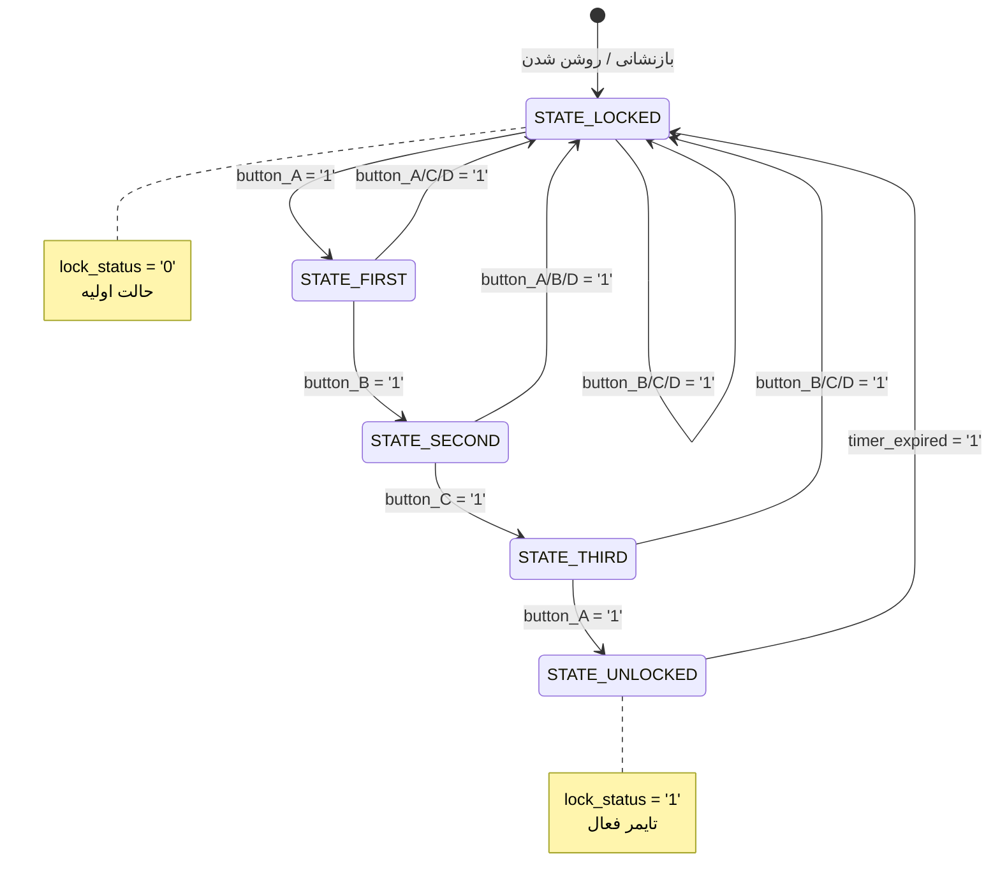

> **[🇬🇧 English Version](digital_lock.md)**

# کنترلر ماشین حالت متناهی قفل دیجیتال

**فایل**: `src/digital_lock.vhd`
**تعداد خطوط**: ۱۵۶
**هدف**: کنترلر اصلی ماشین حالت متناهی (FSM) برای قفل دیجیتال مبتنی بر الگو

---

## فهرست مطالب

- [مقدمه](#مقدمه)
- [واسط موجودیت](#واسط-موجودیت)
- [معماری](#معماری)
- [ماشین حالت](#ماشین-حالت)
- [فرآیندها](#فرآیندها)
- [مثال استفاده](#مثال-استفاده)
- [نمودار زمانی](#نمودار-زمانی)
- [تصمیمات طراحی](#تصمیمات-طراحی)

---

## مقدمه

ماژول `digital_lock` هسته اصلی سیستم قفل مبتنی بر الگو است. این ماژول یک ماشین حالت متناهی ۵ حالته پیاده‌سازی می‌کند که:

1. ورودی‌های دکمه را برای توالی صحیح باز کردن (A → B → C → A) بررسی می‌کند
2. با فشردن دکمه‌های صحیح بین حالات گذر می‌کند
3. با فشردن دکمه اشتباه به حالت قفل‌شده بازمی‌گردد
4. پس از یک زمان قابل تنظیم به صورت خودکار مجدداً قفل می‌شود

<details>
<summary>ماژول در VHDL چیست؟</summary>

یک **ماژول** (که در VHDL به آن «موجودیت» گفته می‌شود) مانند یک جعبه سیاه است که دارای:
- **ورودی‌ها**: سیگنال‌هایی که وارد می‌شوند (دکمه‌ها، کلاک، بازنشانی)
- **خروجی‌ها**: سیگنال‌هایی که خارج می‌شوند (وضعیت قفل)
- **منطق داخلی**: نحوه پردازش ورودی‌ها برای تولید خروجی‌ها

ماژول‌ها می‌توانند مانند قطعات لِگو به یکدیگر متصل شوند تا سیستم‌های پیچیده بسازند.

</details>

---

## واسط موجودیت

```vhdl
entity digital_lock is
    Generic (
        UNLOCK_TIME : integer := 5
    );
    Port (
        clk          : in  std_logic;
        reset        : in  std_logic;
        button_A     : in  std_logic;
        button_B     : in  std_logic;
        button_C     : in  std_logic;
        button_D     : in  std_logic;
        lock_status  : out std_logic
    );
end digital_lock;
```

### پارامترهای عمومی (Generic)

| پارامتر | نوع | مقدار پیش‌فرض | توضیحات |
|---------|-----|---------------|---------|
| `UNLOCK_TIME` | integer | ۵ | سیکل‌های کلاک قبل از قفل خودکار مجدد |

<details>
<summary>پارامترهای عمومی چیست؟</summary>

**پارامترهای عمومی** مانند پارامترهای تابع هستند اما برای ماژول‌های سخت‌افزاری. آن‌ها امکان پیکربندی یک ماژول را بدون تغییر کد فراهم می‌کنند:

```vhdl
-- استفاده از تاخیر کوتاه برای شبیه‌سازی
uut: digital_lock generic map (UNLOCK_TIME => 5)

-- استفاده از تاخیر طولانی برای سخت‌افزار واقعی (۵ ثانیه در ۱۰۰ مگاهرتز)
real_lock: digital_lock generic map (UNLOCK_TIME => 500_000_000)
```

</details>

### پورت‌ها

| پورت | جهت | نوع | توضیحات |
|------|-----|-----|---------|
| `clk` | ورودی | std_logic | کلاک سیستم (تحریک با لبه بالارونده) |
| `reset` | ورودی | std_logic | بازنشانی ناهمگام، فعال-بالا |
| `button_A` | ورودی | std_logic | ورودی دکمه A (پالس تک‌سیکلی) |
| `button_B` | ورودی | std_logic | ورودی دکمه B (پالس تک‌سیکلی) |
| `button_C` | ورودی | std_logic | ورودی دکمه C (پالس تک‌سیکلی) |
| `button_D` | ورودی | std_logic | ورودی دکمه D (فریب‌دهنده، همیشه اشتباه) |
| `lock_status` | خروجی | std_logic | '1' = باز، '0' = قفل |

<details>
<summary>std_logic چیست؟</summary>

`std_logic` نوع سیگنال استاندارد در VHDL است که یک سیم منفرد را نشان می‌دهد. می‌تواند ۹ مقدار داشته باشد، اما رایج‌ترین‌ها عبارتند از:

- `'0'`: سطح منطقی پایین (زمین، نادرست)
- `'1'`: سطح منطقی بالا (ولتاژ، درست)
- `'U'`: مقداردهی نشده (فقط شبیه‌سازی)
- `'X'`: نامعلوم/تداخل (فقط شبیه‌سازی)
- `'Z'`: امپدانس بالا (سه‌حالته)

</details>

---

## معماری

### سیگنال‌های داخلی

```vhdl
type state_type is (STATE_LOCKED, STATE_FIRST, STATE_SECOND,
                    STATE_THIRD, STATE_UNLOCKED);

signal current_state : state_type := STATE_LOCKED;
signal next_state    : state_type;
signal unlock_timer  : integer range 0 to UNLOCK_TIME := 0;
signal timer_expired : std_logic := '0';
```

| سیگنال | نوع | توضیحات |
|--------|-----|---------|
| `current_state` | state_type | حالت فعلی ماشین حالت |
| `next_state` | state_type | حالت بعدی ماشین حالت (ترکیبی) |
| `unlock_timer` | integer | شمارنده معکوس برای قفل خودکار مجدد |
| `timer_expired` | std_logic | پرچم زمانی که تایمر به UNLOCK_TIME می‌رسد |

<details>
<summary>درک انواع شمارشی</summary>

```vhdl
type state_type is (STATE_LOCKED, STATE_FIRST, STATE_SECOND,
                    STATE_THIRD, STATE_UNLOCKED);
```

این یک نوع سفارشی با دقیقاً ۵ مقدار ممکن ایجاد می‌کند. مانند enum در زبان‌های دیگر است. سنتزکننده این را به صورت خودکار به دودویی تبدیل می‌کند (معمولاً ۳ بیت برای ۵ حالت).

</details>

---

## ماشین حالت

### نمودار حالت



<details>
<summary>نمودار متنی (در صورت عدم نمایش Mermaid)</summary>

```
                                    ┌─────────────────────────┐
                                    │      بازنشانی           │
                                    └───────────┬─────────────┘
                                                │
                                                ▼
    ┌─────────────────────────────────────────────────────────────────────┐
    │                            STATE_LOCKED                              │
    │                          (lock_status = '0')                         │
    └─────────────────────────────────┬───────────────────────────────────┘
                                      │
                              button_A = '1'
                                      │
                                      ▼
    ┌─────────────────────────────────────────────────────────────────────┐
    │                            STATE_FIRST                               │
    │                    (انتظار برای دکمه B)                              │
    └───────────┬─────────────────────┴───────────────────┬───────────────┘
                │                                         │
        button_B = '1'                           هر دکمه دیگر
                │                                         │
                ▼                                         │
    ┌─────────────────────────────────────────────┐      │
    │              STATE_SECOND                    │      │
    │         (انتظار برای دکمه C)                 │      │
    └───────────┬─────────────────┬───────────────┘      │
                │                 │                       │
        button_C = '1'     هر دکمه دیگر                  │
                │                 │                       │
                ▼                 │                       │
    ┌─────────────────────────────────────────────┐      │
    │               STATE_THIRD                    │      │
    │          (انتظار برای دکمه A)                │      │
    └───────────┬─────────────────┬───────────────┘      │
                │                 │                       │
        button_A = '1'     هر دکمه دیگر                  │
                │                 │                       │
                ▼                 └───────────────────────┤
    ┌─────────────────────────────────────────────┐      │
    │              STATE_UNLOCKED                  │      │
    │            (lock_status = '1')               │      │
    │           تایمر در حال شمارش...              │      │
    └───────────┬─────────────────────────────────┘      │
                │                                         │
         timer_expired = '1'                              │
                │                                         │
                └─────────────────────────────────────────┘
                                  │
                                  ▼
                       بازگشت به STATE_LOCKED
```

</details>

### جدول انتقال

| حالت فعلی | شرط | حالت بعدی |
|-----------|-----|-----------|
| STATE_LOCKED | button_A = '1' | STATE_FIRST |
| STATE_LOCKED | هر دکمه دیگر | STATE_LOCKED |
| STATE_FIRST | button_B = '1' | STATE_SECOND |
| STATE_FIRST | button_A/C/D = '1' | STATE_LOCKED |
| STATE_SECOND | button_C = '1' | STATE_THIRD |
| STATE_SECOND | button_A/B/D = '1' | STATE_LOCKED |
| STATE_THIRD | button_A = '1' | STATE_UNLOCKED |
| STATE_THIRD | button_B/C/D = '1' | STATE_LOCKED |
| STATE_UNLOCKED | timer_expired = '1' | STATE_LOCKED |
| STATE_UNLOCKED | منقضی نشده | STATE_UNLOCKED |
| هر حالت | reset = '1' | STATE_LOCKED |

---

## فرآیندها

معماری از **الگوی ماشین حالت ۳ فرآیندی** استاندارد به علاوه یک فرآیند اضافی برای تایمر استفاده می‌کند:

### فرآیند ۱: ثبات حالت (ترتیبی)

```vhdl
state_register: process(clk, reset)
begin
    if reset = '1' then
        current_state <= STATE_LOCKED;
    elsif rising_edge(clk) then
        current_state <= next_state;
    end if;
end process;
```

**هدف**: به‌روزرسانی حالت فعلی در هر لبه کلاک. مدیریت بازنشانی ناهمگام.

<details>
<summary>چرا بازنشانی ناهمگام؟</summary>

یک **بازنشانی ناهمگام** (`if reset = '1' then`) بلافاصله اعمال می‌شود، صرف نظر از کلاک. این تضمین می‌کند که سیستم می‌تواند حتی اگر کلاک متوقف یا دچار اشکال شده باشد، بازنشانی شود.

یک **بازنشانی همگام** (`if rising_edge(clk) then if reset = '1' then`) فقط روی لبه‌های کلاک کار می‌کند. ساده‌تر است اما در سخت‌افزار واقعی کمتر قابل اطمینان است.

</details>

### فرآیند ۲: منطق حالت بعدی (ترکیبی)

```vhdl
next_state_logic: process(current_state, button_A, button_B, button_C, button_D, timer_expired)
begin
    next_state <= current_state;  -- پیش‌فرض: ماندن در حالت فعلی

    case current_state is
        when STATE_LOCKED =>
            if button_A = '1' then
                next_state <= STATE_FIRST;
            end if;
            -- B، C، D در حالت LOCKED نادیده گرفته می‌شوند

        when STATE_FIRST =>
            if button_B = '1' then
                next_state <= STATE_SECOND;
            elsif button_A = '1' or button_C = '1' or button_D = '1' then
                next_state <= STATE_LOCKED;  -- دکمه اشتباه!
            end if;
        -- ... مشابه برای سایر حالات
    end case;
end process;
```

**هدف**: تعیین حالت بعدی بر اساس حالت فعلی و ورودی‌ها.

<details>
<summary>درک لیست حساسیت</summary>

بخش `process(current_state, button_A, ...)` **لیست حساسیت** است. فرآیند هر زمان که هر سیگنالی در این لیست تغییر کند، مجدداً اجرا می‌شود.

برای منطق ترکیبی (بدون کلاک)، همه سیگنال‌های خوانده شده در فرآیند را شامل کنید. سیگنال‌های گمشده باعث عدم تطابق شبیه‌سازی/سنتز می‌شوند.

</details>

### فرآیند ۳: منطق خروجی (ترکیبی)

```vhdl
output_logic: process(current_state)
begin
    case current_state is
        when STATE_UNLOCKED =>
            lock_status <= '1';  -- باز!
        when others =>
            lock_status <= '0';  -- قفل
    end case;
end process;
```

**هدف**: تولید خروجی‌ها بر اساس حالت فعلی (سبک ماشین مور).

<details>
<summary>ماشین‌های مور در مقابل میلی</summary>

- **ماشین مور**: خروجی‌ها فقط به حالت فعلی بستگی دارند (در اینجا استفاده شده)
- **ماشین میلی**: خروجی‌ها به حالت فعلی و ورودی‌ها بستگی دارند

ماشین‌های مور ساده‌تر هستند و خروجی‌های پایدارتری دارند. قفل از سبک مور استفاده می‌کند زیرا `lock_status` فقط زمانی تغییر می‌کند که حالت تغییر کند.

</details>

### فرآیند ۴: تایمر باز کردن (ترتیبی)

```vhdl
unlock_timer_proc: process(clk, reset)
begin
    if reset = '1' then
        unlock_timer <= 0;
        timer_expired <= '0';
    elsif rising_edge(clk) then
        if current_state = STATE_UNLOCKED then
            if unlock_timer >= UNLOCK_TIME then
                timer_expired <= '1';
            else
                unlock_timer <= unlock_timer + 1;
            end if;
        else
            unlock_timer <= 0;
            timer_expired <= '0';
        end if;
    end if;
end process;
```

**هدف**: شمارش سیکل‌های کلاک در حالت باز. اعلام اتمام زمان برای قفل خودکار مجدد.

---

## مثال استفاده

### نمونه‌سازی پایه

```vhdl
lock_controller: entity work.digital_lock
    generic map (
        UNLOCK_TIME => 5  -- تاخیر کوتاه برای تست
    )
    port map (
        clk         => system_clock,
        reset       => system_reset,
        button_A    => debounced_btn_a,
        button_B    => debounced_btn_b,
        button_C    => debounced_btn_c,
        button_D    => debounced_btn_d,
        lock_status => led_output
    );
```

### نکات مهم

1. **ورودی‌های دکمه باید حذف نوسان شده باشند**: ماشین حالت پالس‌های تک‌سیکلی تمیز انتظار دارد
2. **ورودی‌ها باید تشخیص لبه داشته باشند**: یک دکمه نگه‌داشته شده باید فقط یک بار ثبت شود
3. **از ماژول button_debouncer استفاده کنید**: این ماژول هم حذف نوسان و هم تشخیص لبه را انجام می‌دهد

---

## نمودار زمانی

```
clk        ─┐ ┌─┐ ┌─┐ ┌─┐ ┌─┐ ┌─┐ ┌─┐ ┌─┐ ┌─┐ ┌─┐ ┌─┐ ┌─┐ ┌─┐ ┌─┐ ┌─
            └─┘ └─┘ └─┘ └─┘ └─┘ └─┘ └─┘ └─┘ └─┘ └─┘ └─┘ └─┘ └─┘ └─┘

button_A   ─────┐       ┌───────────────────────────┐
                └───────┘                           └───────────────
                   ▲                                    ▲
               فشردن A                             فشردن A (نهایی)

button_B   ─────────────┐
                        └───────────────────────────────────────────
                           ▲
                       فشردن B

button_C   ─────────────────────┐
                                └───────────────────────────────────
                                   ▲
                               فشردن C

state      ═LOCKED═╪═FIRST═╪═SECOND═╪═THIRD═╪═══════UNLOCKED═══════╪═LOCKED═

lock_status ─────────────────────────────────┐           ┌──────────
                                             └───────────┘
                                             ▲           ▲
                                          باز      اتمام زمان/قفل مجدد
```

---

## تصمیمات طراحی

### چرا الگوی ماشین حالت ۳ فرآیندی؟

الگوی ۳ فرآیندی (ثبات، منطق حالت بعدی، منطق خروجی) یک استاندارد صنعتی است زیرا:

1. **جداسازی واضح مسئولیت‌ها**: هر فرآیند یک کار دارد
2. **سنتز قابل پیش‌بینی**: سنتزکننده‌ها این الگو را به خوبی درک می‌کنند
3. **اشکال‌زدایی آسان**: حالت و خروجی می‌توانند به طور مستقل ردیابی شوند
4. **قابلیت نگهداری**: اضافه کردن حالات یا تغییر انتقالات آسان است

### چرا بازنشانی ناهمگام؟

بازنشانی ناهمگام تضمین می‌کند که سیستم حتی اگر:
- کلاک متوقف باشد
- کلاک در هنگام روشن شدن ناپایدار باشد
- سیستم نیاز به خاموشی اضطراری داشته باشد

به یک حالت معلوم برسد.

### چرا فرآیند تایمر جداگانه؟

تایمر می‌توانست در فرآیند ثبات حالت ادغام شود، اما جداسازی:
- منطق تایمر را واضح‌تر می‌کند
- تغییر رفتار زمان‌بندی را آسان‌تر می‌کند
- فرآیندها را متمرکز بر مسئولیت‌های منفرد نگه می‌دارد

### چرا دکمه D؟

دکمه D به عنوان یک دکمه «فریب‌دهنده» عمل می‌کند که همیشه سیستم را به حالت LOCKED برمی‌گرداند. این:
- امنیت را افزایش می‌دهد (مهاجم باید بداند کدام دکمه‌ها مهم هستند)
- مدیریت خطا را در ماشین حالت تست می‌کند
- نحوه مدیریت ورودی‌های نامعتبر را نشان می‌دهد
