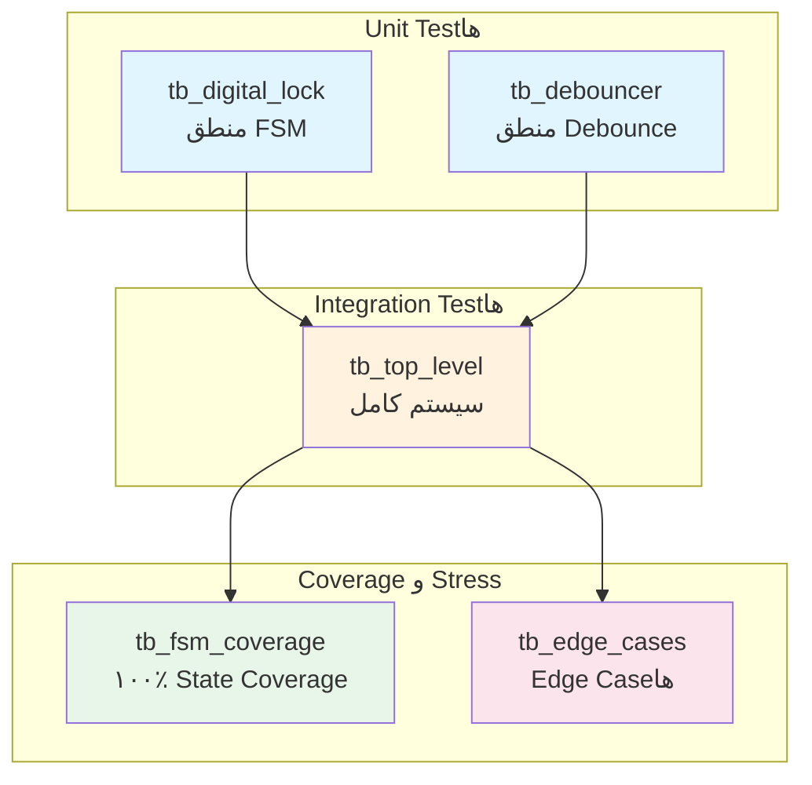
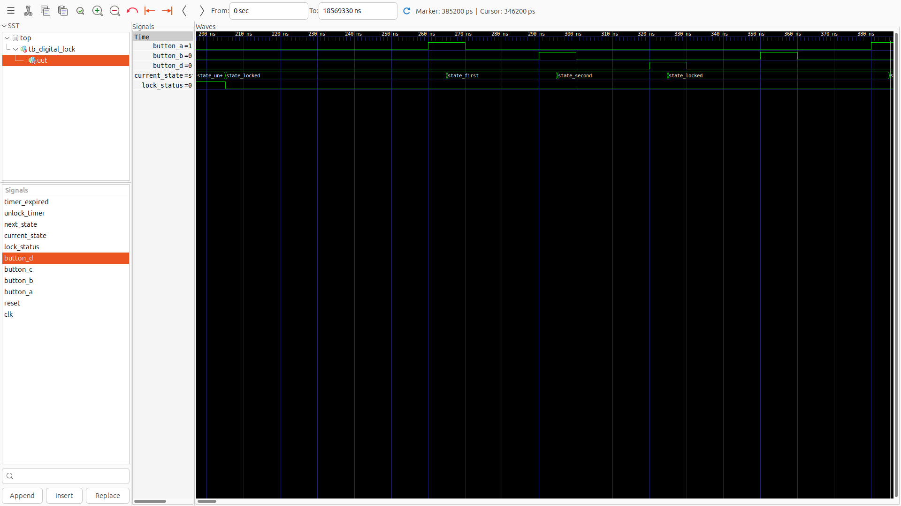

> **[🇬🇧 English Version](testbenches.md)**

# مستندات Testbench

**دایرکتوری**: `testbench/`
**هدف**: Verification جامع سیستم قفل دیجیتال

---

## فهرست مطالب

- [مقدمه](#مقدمه)
- [خلاصه Test Suite](#خلاصه-test-suite)
- [tb_digital_lock.vhd](#tb_digital_lockvhd)
- [tb_top_level.vhd](#tb_top_levelvhd)
- [tb_fsm_coverage.vhd](#tb_fsm_coveragevhd)
- [tb_edge_cases.vhd](#tb_edge_casesvhd)
- [tb_debouncer.vhd](#tb_debouncervhd)
- [اجرای تست‌ها](#اجرای-تست‌ها)
- [درک خروجی تست](#درک-خروجی-تست)
- [نوشتن تست‌های خود](#نوشتن-تست‌های-خود)

---

## مقدمه

Test suite چندین سطح verification ارائه می‌دهد:



| سطح | Testbench | چه چیزی تست می‌کند |
|-----|---------|-------------------|
| Unit | `tb_digital_lock` | FSM controller به صورت مجزا |
| Unit | `tb_debouncer` | Debouncer module به صورت مجزا |
| Integration | `tb_top_level` | سیستم کامل با همه component‌ها |
| Coverage | `tb_fsm_coverage` | همه state‌ها و transition‌ها |
| Stress | `tb_edge_cases` | Edge case‌ها و corner case‌ها |

<details>
<summary>Testbench چیست؟</summary>

یک **testbench** کد VHDL است که کدهای VHDL دیگر را تست می‌کند. بر خلاف module‌های قابل synthesis، testbench‌ها:
- به سخت‌افزار واقعی تبدیل نمی‌شوند
- می‌توانند از ساختارهایی مانند `wait for 10 ns` (تأخیرهای زمانی) استفاده کنند
- Stimulus تولید می‌کنند (فشردن‌های جعلی دکمه)
- نتایج را بررسی می‌کنند (assertion‌ها)
- وضعیت pass/fail را گزارش می‌دهند

آن را مانند unit test برای سخت‌افزار در نظر بگیرید.

</details>

---

## خلاصه Test Suite


| Testbench | Test Case‌ها | Assertion‌ها | وضعیت |
|---------|-----------|-----------|--------|
| `tb_digital_lock` | ۶ | ۶ | ✓ همه Pass |
| `tb_top_level` | ۱۱ | ۱۱ | ✓ همه Pass |
| `tb_fsm_coverage` | ۵ state، ۱۲ transition | ۱۸ | ✓ همه Pass |
| `tb_edge_cases` | ۱۰ | ۲۲ | ✓ همه Pass |
| `tb_debouncer` | ۴ | ۴ | ✓ همه Pass |
| **مجموع** | **۳۶** | **۶۱** | **✓ همه Pass** |

---

## tb_digital_lock.vhd

**هدف**: Unit test هسته FSM
**تعداد خطوط**: ۲۶۴
**فایل**: `testbench/tb_digital_lock.vhd`

### Test Case‌ها

| شناسه | نام تست | توضیحات | نتیجه مورد انتظار |
|-------|---------|---------|------------------|
| TC1 | تست Reset | اعمال signal reset | lock_status = '0' |
| TC2 | توالی صحیح | A→B→C→A | lock_status = '1' |
| TC3 | توالی اشتباه | A→B→D | lock_status = '0' |
| TC4 | دکمه اول اشتباه | B→(سپس صحیح) | lock_status = '1' پس از recovery |
| TC5 | Auto-lock | انتظار پس از unlock | lock_status = '0' |
| TC6 | Reset حین توالی | A→B→[reset] | lock_status = '0' |

### نمونه‌های Waveform

**TC2: توالی صحیح Unlock (A→B→C→A)**


**TC3: تشخیص توالی اشتباه (A→B→D)**



**TC5: Auto-lock Timer**


### جزئیات کلیدی Implementation

```vhdl
-- Single-cycle button pulse (آنچه FSM انتظار دارد)
button_A <= '1';
wait for clk_period;      -- برای دقیقاً ۱ clock بالا
button_A <= '0';
wait for clk_period * 2;  -- انتظار برای پردازش FSM
```

<details>
<summary>چرا Single-cycle Pulse؟</summary>

FSM ورودی‌های edge-detected از debouncer انتظار دارد. در سخت‌افزار واقعی:
- کاربر دکمه را فشار می‌دهد ← debouncer یک pulse خروجی می‌دهد
- Pulse دقیقاً یک clock cycle طول می‌کشد

Testbench باید این رفتار را simulate کند. Pulse‌های طولانی‌تر باعث می‌شوند که FSM چندین «فشردن» ببیند و چندین state پیشروی کند.

</details>

### اجرای این تست

```bash
ghdl -a --std=08 src/digital_lock.vhd
ghdl -a --std=08 testbench/tb_digital_lock.vhd
ghdl -e --std=08 tb_digital_lock
ghdl -r --std=08 tb_digital_lock --wave=simulation/tb_digital_lock.ghw
```

---

## tb_top_level.vhd

**هدف**: Integration test سیستم کامل
**تعداد خطوط**: ۴۲۵
**فایل**: `testbench/tb_top_level.vhd`

### Test Case‌ها

| شناسه | نام تست | توضیحات |
|-------|---------|---------|
| TC1 | Unlock پایه | توالی صحیح unlock می‌کند |
| TC2 | دکمه اول اشتباه | B ابتدا فشرده شده |
| TC3 | دکمه میانی اشتباه | A→B→D (اشتباه در مرحله ۳) |
| TC4 | دکمه آخر اشتباه | A→B→C→B (اشتباه در مرحله ۴) |
| TC5 | Auto-lock | Timer منقضی می‌شود |
| TC6 | Reset حین توالی | قطع با reset |
| TC7 | توالی صحیح تکراری | چندین unlock موفق |
| TC8 | دکمه نگه داشته شده | تست edge detection |
| TC9 | چندین دکمه همزمان | همه دکمه‌ها یکجا |
| TC10 | فشردن سریع دکمه‌ها | توالی سریع |
| BONUS | دکمه فریب D | D هرگز نباید unlock کند |

### ویژگی‌های کلیدی

- تست‌ها شامل **رفتار debouncer** هستند
- **Bouncy button** برای TC7+ simulate می‌شود
- **Edge detection** تست می‌شود (دکمه‌های نگه داشته شده)
- از helper procedure‌ها برای خوانایی استفاده می‌شود

```vhdl
-- Helper procedure برای فشردن تمیز دکمه
procedure press_button(signal btn : out std_logic) is
begin
    btn <= '1';
    wait for clk_period * (DEBOUNCE_CYCLES + 5);
    btn <= '0';
    wait for clk_period * (DEBOUNCE_CYCLES + 5);
end procedure;
```

### اجرای این تست

```bash
ghdl -a --std=08 src/digital_lock.vhd
ghdl -a --std=08 src/button_debouncer.vhd
ghdl -a --std=08 src/top_level.vhd
ghdl -a --std=08 testbench/tb_top_level.vhd
ghdl -e --std=08 tb_top_level
ghdl -r --std=08 tb_top_level --wave=simulation/tb_top_level.ghw
```

---

## tb_fsm_coverage.vhd

**هدف**: ۱۰۰٪ State و Transition Coverage
**تعداد خطوط**: ۱۷۸
**فایل**: `testbench/tb_fsm_coverage.vhd`

### اهداف Coverage

| نوع Coverage | هدف | نتیجه |
|----------|-----|--------|
| State Coverage | ۵/۵ state | ✓ ۱۰۰٪ |
| Transition Coverage | همه transition‌های معتبر | ✓ ۱۰۰٪ |
| Error Transition | همه دکمه‌های نامعتبر | ✓ ۱۰۰٪ |

### State‌های Verify شده

1. **STATE_LOCKED**: State اولیه، پس از reset، پس از دکمه اشتباه
2. **STATE_FIRST**: پس از فشردن A از LOCKED
3. **STATE_SECOND**: پس از فشردن B از FIRST
4. **STATE_THIRD**: پس از فشردن C از SECOND
5. **STATE_UNLOCKED**: پس از فشردن A از THIRD

### Transition‌های Verify شده

**Transition‌های صحیح**:
- LOCKED → FIRST (A)
- FIRST → SECOND (B)
- SECOND → THIRD (C)
- THIRD → UNLOCKED (A)
- UNLOCKED → LOCKED (timeout)

**Error Transition‌ها** (همه → LOCKED):
- LOCKED + B/C/D → در LOCKED می‌ماند
- FIRST + A/C/D → LOCKED
- SECOND + A/B/D → LOCKED
- THIRD + B/C/D → LOCKED

### اجرای این تست

```bash
ghdl -a --std=08 src/digital_lock.vhd
ghdl -a --std=08 testbench/tb_fsm_coverage.vhd
ghdl -e --std=08 tb_fsm_coverage
ghdl -r --std=08 tb_fsm_coverage --wave=simulation/tb_fsm_coverage.ghw
```

---

## tb_edge_cases.vhd

**هدف**: Edge case‌ها و Stress test
**تعداد خطوط**: ۲۳۴
**فایل**: `testbench/tb_edge_cases.vhd`

### Test Case‌ها

| شناسه | نام تست | چه چیزی تست می‌کند |
|-------|---------|-------------------|
| ۱ | Reset حین UNLOCKED | Reset وضعیت unlock را پاک می‌کند |
| ۲ | چندین reset متوالی | سیستم stable می‌ماند |
| ۳ | دکمه در مرز reset | Edge case timing |
| ۴ | همه دکمه‌ها همزمان | مدیریت چند دکمه |
| ۵ | توالی‌های سریع (۱۰x) | Stress test |
| ۶ | مرز Timer | درست قبل/بعد از timeout |
| ۷ | Timeout توالی ناقص | توالی incomplete |
| ۸ | Recovery پس از اشتباه | اشتباه سپس صحیح |
| ۹ | تکرار همان دکمه | A→A→A→A |
| ۱۰ | توالی طولانی با خطاها | چندین خطا سپس success |

### خلاصه Assertion‌ها

```
PASSED: 22
FAILED: 0
=== همه Edge Case Test‌ها Pass شدند ===
```

### الگوهای کلیدی تست

```vhdl
-- تست مرز Timer
unlock_sequence;
check(lock_status = '1', "ابتدا unlocked");
wait for clk_period * 4;  -- درست قبل از timeout
check(lock_status = '1', "هنوز unlocked قبل از timeout");
wait for clk_period * 5;  -- پس از timeout
check(lock_status = '0', "Locked پس از timeout");
```

### اجرای این تست

```bash
ghdl -a --std=08 src/digital_lock.vhd
ghdl -a --std=08 testbench/tb_edge_cases.vhd
ghdl -e --std=08 tb_edge_cases
ghdl -r --std=08 tb_edge_cases --wave=simulation/tb_edge_cases.ghw
```

---

## tb_debouncer.vhd

**هدف**: Unit test برای Debouncer module
**تعداد خطوط**: ~۱۰۰
**فایل**: `testbench/tb_debouncer.vhd`

### Test Case‌ها

| شناسه | نام تست | توضیحات |
|-------|---------|---------|
| ۱ | فشردن تمیز | ورودی stable، باید pulse تولید کند |
| ۲ | فشردن Bouncy | Bounce simulate شده، باید filter کند |
| ۳ | فشردن کوتاه | خیلی کوتاه، باید ignore شود |
| ۴ | دکمه نگه داشته شده | فشردن طولانی، فقط یک pulse |

### تست کلیدی: Bounce Filter

```vhdl
-- Simulate فشردن bouncy دکمه
report "تست ۲: فشردن bouncy دکمه" severity note;
button_in <= '1'; wait for clk_period * 2;
button_in <= '0'; wait for clk_period;  -- bounce!
button_in <= '1'; wait for clk_period * 2;
button_in <= '0'; wait for clk_period;  -- bounce!
button_in <= '1';  -- بالاخره stable
wait for clk_period * (DEBOUNCE_CYCLES + 3);
button_in <= '0';
```

### اجرای این تست

```bash
ghdl -a --std=08 src/button_debouncer.vhd
ghdl -a --std=08 testbench/tb_debouncer.vhd
ghdl -e --std=08 tb_debouncer
ghdl -r --std=08 tb_debouncer --wave=simulation/tb_debouncer.ghw
```

---

## اجرای تست‌ها

### اجرای همه تست‌ها

```bash
#!/bin/bash
# ذخیره به عنوان run_all_tests.sh

# کامپایل source‌ها
ghdl -a --std=08 src/digital_lock.vhd
ghdl -a --std=08 src/button_debouncer.vhd
ghdl -a --std=08 src/top_level.vhd

# اجرای هر testbench
for tb in tb_digital_lock tb_top_level tb_fsm_coverage tb_edge_cases tb_debouncer; do
    echo "=========================================="
    echo "در حال اجرا: $tb"
    echo "=========================================="
    ghdl -a --std=08 testbench/$tb.vhd
    ghdl -e --std=08 $tb
    ghdl -r --std=08 $tb --wave=simulation/$tb.ghw 2>&1
    echo ""
done

echo "همه تست‌ها کامل شد! Waveform‌ها در simulation/ ذخیره شدند"
```

### اجرای تست تکی

```bash
# مثال: فقط FSM coverage test را اجرا کنید
ghdl -a --std=08 src/digital_lock.vhd
ghdl -a --std=08 testbench/tb_fsm_coverage.vhd
ghdl -e --std=08 tb_fsm_coverage
ghdl -r --std=08 tb_fsm_coverage
```

### مشاهده Waveform‌ها

```bash
# مشاهده waveform هر تست
gtkwave simulation/tb_digital_lock.ghw
```

---

## درک خروجی تست

### سطوح Severity

| Severity | معنی | اقدام |
|-----|------|-------|
| `note` | اطلاعات | پیشرفت عادی |
| `warning` | مشکل احتمالی | بررسی کنید |
| `error` | شکست تست | نیاز به fix |
| `failure` | خطای fatal | Simulation متوقف می‌شود |

### خروجی نمونه (Success)

```
=== Starting Digital Lock Testbench ===
TC1: Testing reset functionality
TC1 PASSED: Reset works correctly
TC2: Testing correct sequence A->B->C->A
TC2 PASSED: Correct sequence unlocks the system
...
=== All Test Cases Completed ===
=== Digital Lock Testbench PASSED ===
```

### خروجی نمونه (Failure)

```
TC2: Testing correct sequence A->B->C->A
tb_digital_lock.vhd:138:9:@150ns:(assertion error):
    TC2 FAILED: Lock should be UNLOCKED after correct sequence!
```

<details>
<summary>نحوه Debug کردن Test Failure</summary>

1. **Timestamp را بررسی کنید**: `@150ns` به شما می‌گوید چه زمانی failure رخ داده
2. **Waveform را باز کنید**: `gtkwave simulation/tb_digital_lock.ghw`
3. **به زمان navigate کنید**: به ۱۵۰ns در waveform بروید
4. **مقادیر signal را بررسی کنید**: به button press‌ها، state transition‌ها نگاه کنید
5. **به عقب trace کنید**: پیدا کنید که رفتار کجا از انتظار منحرف شده

مشکلات رایج:
- Timing اشتباه (خیلی سریع/کند)
- Signal هنگام check کردن stable نیست
- Initial condition اشتباه

</details>

---

## نوشتن تست‌های خود

### ساختار پایه

```vhdl
library IEEE;
use IEEE.STD_LOGIC_1164.ALL;

entity tb_my_test is
    -- Testbench‌ها port ندارند
end tb_my_test;

architecture Behavioral of tb_my_test is
    -- Signal‌های منطبق با port‌های DUT
    signal clk : std_logic := '0';
    signal reset : std_logic := '0';
    -- ... signal‌های بیشتر

    constant clk_period : time := 10 ns;

begin
    -- Instantiation دستگاه تحت تست (DUT)
    uut: entity work.my_component
        port map (
            clk => clk,
            reset => reset
            -- ... mapping‌های بیشتر
        );

    -- تولید Clock
    clk_process: process
    begin
        clk <= '0'; wait for clk_period/2;
        clk <= '1'; wait for clk_period/2;
    end process;

    -- Test Stimulus
    stim_proc: process
    begin
        report "شروع تست" severity note;

        -- کد تست شما اینجا
        reset <= '1';
        wait for clk_period * 2;
        reset <= '0';

        -- بررسی نتایج
        assert some_signal = expected_value
            report "تست fail شد!"
            severity error;

        report "تست pass شد!" severity note;
        wait;  -- پایان simulation
    end process;

end Behavioral;
```

### الگوهای مفید

**Helper Procedure**:
```vhdl
procedure pulse_button(signal btn : out std_logic) is
begin
    btn <= '1';
    wait for clk_period;
    btn <= '0';
    wait for clk_period * 2;
end procedure;
```

**Check Procedure**:
```vhdl
procedure check(condition : boolean; msg : string) is
begin
    assert condition
        report "FAIL: " & msg
        severity error;
    if condition then
        report "PASS: " & msg severity note;
    end if;
end procedure;
```

**Counter برای آمار تست**:
```vhdl
signal pass_count : integer := 0;
signal fail_count : integer := 0;

-- در check procedure:
if condition then
    pass_count <= pass_count + 1;
else
    fail_count <= fail_count + 1;
end if;
```
