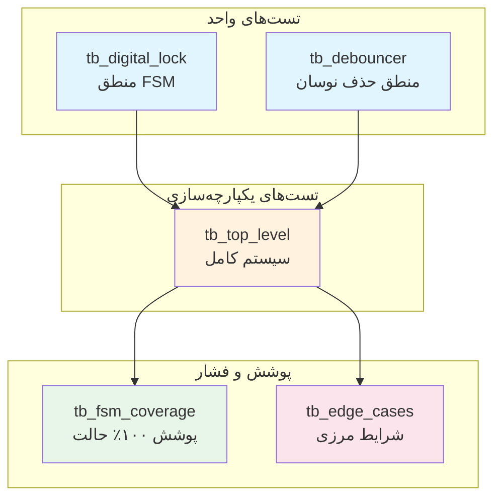

> **[🇬🇧 English Version](testbenches.md)**

# مستندات تست‌بنچ

**دایرکتوری**: `testbench/`
**هدف**: تأیید جامع سیستم قفل دیجیتال

---

## فهرست مطالب

- [مقدمه](#مقدمه)
- [خلاصه مجموعه تست](#خلاصه-مجموعه-تست)
- [tb_digital_lock.vhd](#tb_digital_lockvhd)
- [tb_top_level.vhd](#tb_top_levelvhd)
- [tb_fsm_coverage.vhd](#tb_fsm_coveragevhd)
- [tb_edge_cases.vhd](#tb_edge_casesvhd)
- [tb_debouncer.vhd](#tb_debouncervhd)
- [اجرای تست‌ها](#اجرای-تست‌ها)
- [درک خروجی تست](#درک-خروجی-تست)
- [نوشتن تست‌های خود](#نوشتن-تست‌های-خود)

---

## مقدمه

مجموعه تست چندین سطح تأیید ارائه می‌دهد:



| سطح | تست‌بنچ | چه چیزی تست می‌کند |
|-----|---------|-------------------|
| واحد | `tb_digital_lock` | کنترلر FSM به صورت مجزا |
| واحد | `tb_debouncer` | ماژول حذف‌کننده نوسان به صورت مجزا |
| یکپارچه‌سازی | `tb_top_level` | سیستم کامل با همه اجزا |
| پوشش | `tb_fsm_coverage` | همه حالات و انتقالات |
| فشار | `tb_edge_cases` | شرایط مرزی و موارد گوشه‌ای |

<details>
<summary>تست‌بنچ چیست؟</summary>

یک **تست‌بنچ** کد VHDL است که کدهای VHDL دیگر را تست می‌کند. بر خلاف ماژول‌های قابل سنتز، تست‌بنچ‌ها:
- به سخت‌افزار واقعی تبدیل نمی‌شوند
- می‌توانند از ساختارهایی مانند `wait for 10 ns` (تأخیرهای زمانی) استفاده کنند
- محرک تولید می‌کنند (فشردن‌های جعلی دکمه)
- نتایج را بررسی می‌کنند (تأییدیه‌ها)
- وضعیت موفقیت/شکست را گزارش می‌دهند

آن را مانند تست‌های واحد برای سخت‌افزار در نظر بگیرید.

</details>

---

## خلاصه مجموعه تست

| تست‌بنچ | موارد تست | تأییدیه‌ها | وضعیت |
|---------|-----------|-----------|--------|
| `tb_digital_lock` | ۶ | ۶ | ✓ همه موفق |
| `tb_top_level` | ۱۱ | ۱۱ | ✓ همه موفق |
| `tb_fsm_coverage` | ۵ حالت، ۱۲ انتقال | ۱۸ | ✓ همه موفق |
| `tb_edge_cases` | ۱۰ | ۲۲ | ✓ همه موفق |
| `tb_debouncer` | ۴ | ۴ | ✓ همه موفق |
| **مجموع** | **۳۶** | **۶۱** | **✓ همه موفق** |

---

## tb_digital_lock.vhd

**هدف**: تست واحد هسته ماشین حالت
**تعداد خطوط**: ۲۶۴
**فایل**: `testbench/tb_digital_lock.vhd`

### موارد تست

| شناسه | نام تست | توضیحات | نتیجه مورد انتظار |
|-------|---------|---------|------------------|
| TC1 | تست بازنشانی | اعمال سیگنال بازنشانی | lock_status = '0' |
| TC2 | توالی صحیح | A→B→C→A | lock_status = '1' |
| TC3 | توالی اشتباه | A→B→D | lock_status = '0' |
| TC4 | دکمه اول اشتباه | B→(سپس صحیح) | lock_status = '1' پس از بازیابی |
| TC5 | قفل خودکار مجدد | انتظار پس از باز شدن | lock_status = '0' |
| TC6 | بازنشانی حین توالی | A→B→[بازنشانی] | lock_status = '0' |

### جزئیات کلیدی پیاده‌سازی

```vhdl
-- پالس تک‌سیکلی دکمه (آنچه FSM انتظار دارد)
button_A <= '1';
wait for clk_period;      -- برای دقیقاً ۱ کلاک بالا
button_A <= '0';
wait for clk_period * 2;  -- انتظار برای پردازش FSM
```

<details>
<summary>چرا پالس‌های تک‌سیکلی؟</summary>

ماشین حالت ورودی‌های تشخیص لبه شده از حذف‌کننده نوسان انتظار دارد. در سخت‌افزار واقعی:
- کاربر دکمه را فشار می‌دهد ← حذف‌کننده نوسان یک پالس خروجی می‌دهد
- پالس دقیقاً یک سیکل کلاک طول می‌کشد

تست‌بنچ باید این رفتار را شبیه‌سازی کند. پالس‌های طولانی‌تر باعث می‌شوند که ماشین حالت چندین «فشردن» ببیند و چندین حالت پیشروی کند.

</details>

### اجرای این تست

```bash
ghdl -a --std=08 src/digital_lock.vhd
ghdl -a --std=08 testbench/tb_digital_lock.vhd
ghdl -e --std=08 tb_digital_lock
ghdl -r --std=08 tb_digital_lock --wave=simulation/tb_digital_lock.ghw
```

---

## tb_top_level.vhd

**هدف**: تست یکپارچه‌سازی سیستم کامل
**تعداد خطوط**: ۴۲۵
**فایل**: `testbench/tb_top_level.vhd`

### موارد تست

| شناسه | نام تست | توضیحات |
|-------|---------|---------|
| TC1 | باز کردن پایه | توالی صحیح باز می‌کند |
| TC2 | دکمه اول اشتباه | B ابتدا فشرده شده |
| TC3 | دکمه میانی اشتباه | A→B→D (اشتباه در مرحله ۳) |
| TC4 | دکمه آخر اشتباه | A→B→C→B (اشتباه در مرحله ۴) |
| TC5 | قفل خودکار مجدد | تایمر منقضی می‌شود |
| TC6 | بازنشانی حین توالی | قطع با بازنشانی |
| TC7 | توالی صحیح تکراری | چندین باز کردن موفق |
| TC8 | دکمه نگه داشته شده | تست تشخیص لبه |
| TC9 | چندین دکمه همزمان | همه دکمه‌ها یکجا |
| TC10 | فشردن سریع دکمه‌ها | توالی سریع |
| BONUS | دکمه فریب D | D هرگز نباید باز کند |

### ویژگی‌های کلیدی

- تست‌ها شامل **رفتار حذف‌کننده نوسان** هستند
- **دکمه‌های نوسانی** برای TC7+ شبیه‌سازی می‌شود
- **تشخیص لبه** تست می‌شود (دکمه‌های نگه داشته شده)
- از رویه‌های کمکی برای خوانایی استفاده می‌شود

```vhdl
-- رویه کمکی برای فشردن تمیز دکمه
procedure press_button(signal btn : out std_logic) is
begin
    btn <= '1';
    wait for clk_period * (DEBOUNCE_CYCLES + 5);
    btn <= '0';
    wait for clk_period * (DEBOUNCE_CYCLES + 5);
end procedure;
```

### اجرای این تست

```bash
ghdl -a --std=08 src/digital_lock.vhd
ghdl -a --std=08 src/button_debouncer.vhd
ghdl -a --std=08 src/top_level.vhd
ghdl -a --std=08 testbench/tb_top_level.vhd
ghdl -e --std=08 tb_top_level
ghdl -r --std=08 tb_top_level --wave=simulation/tb_top_level.ghw
```

---

## tb_fsm_coverage.vhd

**هدف**: پوشش ۱۰۰٪ حالت و انتقال
**تعداد خطوط**: ۱۷۸
**فایل**: `testbench/tb_fsm_coverage.vhd`

### اهداف پوشش

| نوع پوشش | هدف | نتیجه |
|----------|-----|--------|
| پوشش حالت | ۵/۵ حالت | ✓ ۱۰۰٪ |
| پوشش انتقال | همه انتقالات معتبر | ✓ ۱۰۰٪ |
| انتقالات خطا | همه دکمه‌های نامعتبر | ✓ ۱۰۰٪ |

### حالات تأیید شده

1. **STATE_LOCKED**: حالت اولیه، پس از بازنشانی، پس از دکمه اشتباه
2. **STATE_FIRST**: پس از فشردن A از LOCKED
3. **STATE_SECOND**: پس از فشردن B از FIRST
4. **STATE_THIRD**: پس از فشردن C از SECOND
5. **STATE_UNLOCKED**: پس از فشردن A از THIRD

### انتقالات تأیید شده

**انتقالات صحیح**:
- LOCKED → FIRST (A)
- FIRST → SECOND (B)
- SECOND → THIRD (C)
- THIRD → UNLOCKED (A)
- UNLOCKED → LOCKED (اتمام زمان)

**انتقالات خطا** (همه → LOCKED):
- LOCKED + B/C/D → در LOCKED می‌ماند
- FIRST + A/C/D → LOCKED
- SECOND + A/B/D → LOCKED
- THIRD + B/C/D → LOCKED

### اجرای این تست

```bash
ghdl -a --std=08 src/digital_lock.vhd
ghdl -a --std=08 testbench/tb_fsm_coverage.vhd
ghdl -e --std=08 tb_fsm_coverage
ghdl -r --std=08 tb_fsm_coverage --wave=simulation/tb_fsm_coverage.ghw
```

---

## tb_edge_cases.vhd

**هدف**: شرایط مرزی و تست فشار
**تعداد خطوط**: ۲۳۴
**فایل**: `testbench/tb_edge_cases.vhd`

### موارد تست

| شناسه | نام تست | چه چیزی تست می‌کند |
|-------|---------|-------------------|
| ۱ | بازنشانی حین UNLOCKED | بازنشانی وضعیت باز را پاک می‌کند |
| ۲ | چندین بازنشانی متوالی | سیستم پایدار می‌ماند |
| ۳ | دکمه در مرز بازنشانی | مورد لبه زمان‌بندی |
| ۴ | همه دکمه‌ها همزمان | مدیریت چند دکمه |
| ۵ | توالی‌های سریع (۱۰x) | تست فشار |
| ۶ | مرز تایمر | درست قبل/بعد از اتمام زمان |
| ۷ | اتمام زمان توالی ناقص | توالی ناکامل |
| ۸ | بازیابی پس از اشتباه | اشتباه سپس صحیح |
| ۹ | تکرار همان دکمه | A→A→A→A |
| ۱۰ | توالی طولانی با خطاها | چندین خطا سپس موفقیت |

### خلاصه تأییدیه‌ها

```
PASSED: 22
FAILED: 0
=== همه تست‌های موارد لبه موفق شدند ===
```

### الگوهای کلیدی تست

```vhdl
-- تست مرز تایمر
unlock_sequence;
check(lock_status = '1', "ابتدا باز");
wait for clk_period * 4;  -- درست قبل از اتمام زمان
check(lock_status = '1', "هنوز باز قبل از اتمام زمان");
wait for clk_period * 5;  -- پس از اتمام زمان
check(lock_status = '0', "قفل پس از اتمام زمان");
```

### اجرای این تست

```bash
ghdl -a --std=08 src/digital_lock.vhd
ghdl -a --std=08 testbench/tb_edge_cases.vhd
ghdl -e --std=08 tb_edge_cases
ghdl -r --std=08 tb_edge_cases --wave=simulation/tb_edge_cases.ghw
```

---

## tb_debouncer.vhd

**هدف**: تست واحد ماژول حذف‌کننده نوسان
**تعداد خطوط**: ~۱۰۰
**فایل**: `testbench/tb_debouncer.vhd`

### موارد تست

| شناسه | نام تست | توضیحات |
|-------|---------|---------|
| ۱ | فشردن تمیز | ورودی پایدار، باید پالس تولید کند |
| ۲ | فشردن نوسانی | نوسان شبیه‌سازی شده، باید فیلتر کند |
| ۳ | فشردن کوتاه | خیلی کوتاه، باید نادیده گرفته شود |
| ۴ | دکمه نگه داشته شده | فشردن طولانی، فقط یک پالس |

### تست کلیدی: فیلتر نوسان

```vhdl
-- شبیه‌سازی فشردن نوسانی دکمه
report "تست ۲: فشردن نوسانی دکمه" severity note;
button_in <= '1'; wait for clk_period * 2;
button_in <= '0'; wait for clk_period;  -- نوسان!
button_in <= '1'; wait for clk_period * 2;
button_in <= '0'; wait for clk_period;  -- نوسان!
button_in <= '1';  -- بالاخره پایدار
wait for clk_period * (DEBOUNCE_CYCLES + 3);
button_in <= '0';
```

### اجرای این تست

```bash
ghdl -a --std=08 src/button_debouncer.vhd
ghdl -a --std=08 testbench/tb_debouncer.vhd
ghdl -e --std=08 tb_debouncer
ghdl -r --std=08 tb_debouncer --wave=simulation/tb_debouncer.ghw
```

---

## اجرای تست‌ها

### اجرای همه تست‌ها

```bash
#!/bin/bash
# ذخیره به عنوان run_all_tests.sh

# کامپایل منابع
ghdl -a --std=08 src/digital_lock.vhd
ghdl -a --std=08 src/button_debouncer.vhd
ghdl -a --std=08 src/top_level.vhd

# اجرای هر تست‌بنچ
for tb in tb_digital_lock tb_top_level tb_fsm_coverage tb_edge_cases tb_debouncer; do
    echo "=========================================="
    echo "در حال اجرا: $tb"
    echo "=========================================="
    ghdl -a --std=08 testbench/$tb.vhd
    ghdl -e --std=08 $tb
    ghdl -r --std=08 $tb --wave=simulation/$tb.ghw 2>&1
    echo ""
done

echo "همه تست‌ها کامل شد! شکل موج‌ها در simulation/ ذخیره شدند"
```

### اجرای تست تکی

```bash
# مثال: فقط تست پوشش FSM را اجرا کنید
ghdl -a --std=08 src/digital_lock.vhd
ghdl -a --std=08 testbench/tb_fsm_coverage.vhd
ghdl -e --std=08 tb_fsm_coverage
ghdl -r --std=08 tb_fsm_coverage
```

### مشاهده شکل موج‌ها

```bash
# مشاهده شکل موج هر تست
gtkwave simulation/tb_digital_lock.ghw
```

---

## درک خروجی تست

### سطوح شدت

| شدت | معنی | اقدام |
|-----|------|-------|
| `note` | اطلاعات | پیشرفت عادی |
| `warning` | مشکل احتمالی | بررسی کنید |
| `error` | شکست تست | نیاز به اصلاح |
| `failure` | خطای کشنده | شبیه‌سازی متوقف می‌شود |

### خروجی نمونه (موفقیت)

```
=== شروع تست‌بنچ قفل دیجیتال ===
TC1: تست عملکرد بازنشانی
TC1 موفق: بازنشانی به درستی کار می‌کند
TC2: تست توالی صحیح A->B->C->A
TC2 موفق: توالی صحیح سیستم را باز می‌کند
...
=== همه موارد تست کامل شد ===
=== تست‌بنچ قفل دیجیتال موفق شد ===
```

### خروجی نمونه (شکست)

```
TC2: تست توالی صحیح A->B->C->A
tb_digital_lock.vhd:138:9:@150ns:(assertion error):
    TC2 شکست: قفل باید پس از توالی صحیح باز باشد!
```

<details>
<summary>نحوه اشکال‌زدایی شکست تست</summary>

1. **برچسب زمانی را بررسی کنید**: `@150ns` به شما می‌گوید چه زمانی شکست رخ داده
2. **شکل موج را باز کنید**: `gtkwave simulation/tb_digital_lock.ghw`
3. **به زمان بروید**: به ۱۵۰ns در شکل موج بروید
4. **مقادیر سیگنال را بررسی کنید**: به فشردن‌های دکمه، گذارهای حالت نگاه کنید
5. **به عقب ردیابی کنید**: پیدا کنید که رفتار کجا از انتظار منحرف شده

مشکلات رایج:
- زمان‌بندی اشتباه (خیلی سریع/کند)
- سیگنال هنگام بررسی پایدار نیست
- شرایط اولیه اشتباه

</details>

---

## نوشتن تست‌های خود

### ساختار پایه

```vhdl
library IEEE;
use IEEE.STD_LOGIC_1164.ALL;

entity tb_my_test is
    -- تست‌بنچ‌ها پورت ندارند
end tb_my_test;

architecture Behavioral of tb_my_test is
    -- سیگنال‌های منطبق با پورت‌های DUT
    signal clk : std_logic := '0';
    signal reset : std_logic := '0';
    -- ... سیگنال‌های بیشتر

    constant clk_period : time := 10 ns;

begin
    -- نمونه‌سازی دستگاه تحت تست (DUT)
    uut: entity work.my_component
        port map (
            clk => clk,
            reset => reset
            -- ... نگاشت‌های بیشتر
        );

    -- تولید کلاک
    clk_process: process
    begin
        clk <= '0'; wait for clk_period/2;
        clk <= '1'; wait for clk_period/2;
    end process;

    -- محرک تست
    stim_proc: process
    begin
        report "شروع تست" severity note;

        -- کد تست شما اینجا
        reset <= '1';
        wait for clk_period * 2;
        reset <= '0';

        -- بررسی نتایج
        assert some_signal = expected_value
            report "تست شکست خورد!"
            severity error;

        report "تست موفق!" severity note;
        wait;  -- پایان شبیه‌سازی
    end process;

end Behavioral;
```

### الگوهای مفید

**رویه کمکی**:
```vhdl
procedure pulse_button(signal btn : out std_logic) is
begin
    btn <= '1';
    wait for clk_period;
    btn <= '0';
    wait for clk_period * 2;
end procedure;
```

**رویه بررسی**:
```vhdl
procedure check(condition : boolean; msg : string) is
begin
    assert condition
        report "شکست: " & msg
        severity error;
    if condition then
        report "موفق: " & msg severity note;
    end if;
end procedure;
```

**شمارنده برای آمار تست**:
```vhdl
signal pass_count : integer := 0;
signal fail_count : integer := 0;

-- در رویه بررسی:
if condition then
    pass_count <= pass_count + 1;
else
    fail_count <= fail_count + 1;
end if;
```
