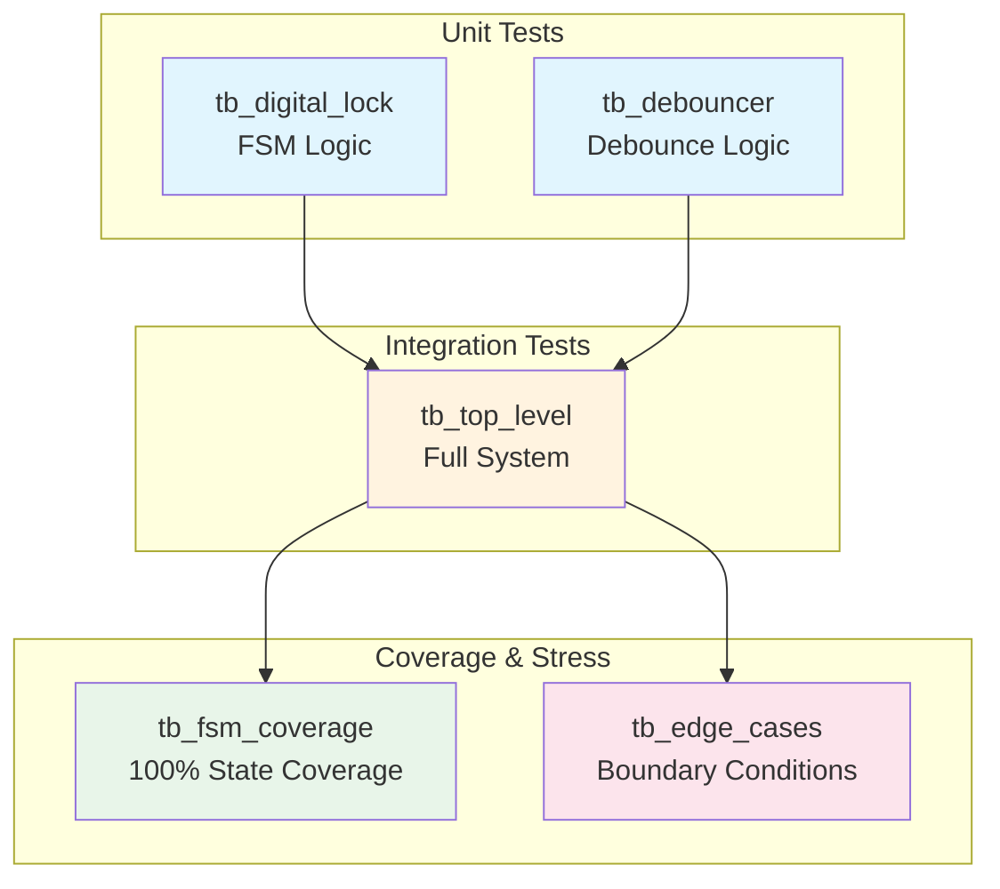

> **[🇮🇷 نسخه فارسی](testbenches-fa.md)**

# Testbench Documentation

**Directory**: `testbench/`
**Purpose**: Comprehensive verification of the digital lock system

---

## Table of Contents

- [Overview](#overview)
- [Test Suite Summary](#test-suite-summary)
- [tb_digital_lock.vhd](#tb_digital_lockvhd)
- [tb_top_level.vhd](#tb_top_levelvhd)
- [tb_fsm_coverage.vhd](#tb_fsm_coveragevhd)
- [tb_edge_cases.vhd](#tb_edge_casesvhd)
- [tb_debouncer.vhd](#tb_debouncervhd)
- [Running Tests](#running-tests)
- [Understanding Test Output](#understanding-test-output)
- [Writing Your Own Tests](#writing-your-own-tests)

---

## Overview

The test suite provides multiple levels of verification:



| Level | Testbench | What It Tests |
|-------|-----------|---------------|
| Unit | `tb_digital_lock` | FSM controller in isolation |
| Unit | `tb_debouncer` | Debouncer module in isolation |
| Integration | `tb_top_level` | Complete system with all components |
| Coverage | `tb_fsm_coverage` | All states and transitions |
| Stress | `tb_edge_cases` | Boundary conditions and corner cases |

<details>
<summary>What are testbenches?</summary>

A **testbench** is VHDL code that tests other VHDL code. Unlike synthesizable modules, testbenches:
- Don't become real hardware
- Can use constructs like `wait for 10 ns` (time delays)
- Generate stimulus (fake button presses)
- Check results (assertions)
- Report pass/fail status

Think of it like unit tests for hardware.

</details>

---

## Test Suite Summary

| Testbench | Test Cases | Assertions | Status |
|-----------|------------|------------|--------|
| `tb_digital_lock` | 6 | 6 | ✓ All Pass |
| `tb_top_level` | 11 | 11 | ✓ All Pass |
| `tb_fsm_coverage` | 5 states, 12 transitions | 18 | ✓ All Pass |
| `tb_edge_cases` | 10 | 22 | ✓ All Pass |
| `tb_debouncer` | 4 | 4 | ✓ All Pass |
| **Total** | **36** | **61** | **✓ All Pass** |

---

## tb_digital_lock.vhd

**Purpose**: Core FSM unit testing
**Lines**: 264
**File**: `testbench/tb_digital_lock.vhd`

### Test Cases

| ID | Test Name | Description | Expected Result |
|----|-----------|-------------|-----------------|
| TC1 | Reset Test | Apply reset signal | lock_status = '0' |
| TC2 | Correct Sequence | A→B→C→A | lock_status = '1' |
| TC3 | Wrong Sequence | A→B→D | lock_status = '0' |
| TC4 | Wrong First Button | B→(then correct) | lock_status = '1' after recovery |
| TC5 | Auto-Relock | Wait after unlock | lock_status = '0' |
| TC6 | Reset During Sequence | A→B→[reset] | lock_status = '0' |

### Key Implementation Details

```vhdl
-- Single-cycle button pulse (what FSM expects)
button_A <= '1';
wait for clk_period;      -- HIGH for exactly 1 clock
button_A <= '0';
wait for clk_period * 2;  -- Wait for FSM to process
```

<details>
<summary>Why single-cycle pulses?</summary>

The FSM expects edge-detected inputs from the debouncer. In real hardware:
- User presses button → Debouncer outputs ONE pulse
- Pulse lasts exactly one clock cycle

The testbench must simulate this behavior. Longer pulses would cause the FSM to see multiple "presses" and advance multiple states.

</details>

### Running This Test

```bash
ghdl -a --std=08 src/digital_lock.vhd
ghdl -a --std=08 testbench/tb_digital_lock.vhd
ghdl -e --std=08 tb_digital_lock
ghdl -r --std=08 tb_digital_lock --wave=simulation/tb_digital_lock.ghw
```

---

## tb_top_level.vhd

**Purpose**: Full system integration testing
**Lines**: 425
**File**: `testbench/tb_top_level.vhd`

### Test Cases

| ID | Test Name | Description |
|----|-----------|-------------|
| TC1 | Basic Unlock | Correct sequence unlocks |
| TC2 | Wrong First Button | B pressed first |
| TC3 | Wrong Middle Button | A→B→D (wrong at step 3) |
| TC4 | Wrong Last Button | A→B→C→B (wrong at step 4) |
| TC5 | Auto-Relock | Timer expires |
| TC6 | Reset During Sequence | Interrupt with reset |
| TC7 | Repeated Correct Sequence | Multiple successful unlocks |
| TC8 | Button Held Down | Edge detection test |
| TC9 | Multiple Simultaneous Buttons | All buttons at once |
| TC10 | Fast Button Presses | Rapid sequence |
| BONUS | D Button Decoy | D should never unlock |

### Key Features

- Tests include **debouncer behavior**
- Simulates **bouncy buttons** for TC7+
- Tests **edge detection** (held buttons)
- Uses helper procedures for readability

```vhdl
-- Helper procedure for clean button press
procedure press_button(signal btn : out std_logic) is
begin
    btn <= '1';
    wait for clk_period * (DEBOUNCE_CYCLES + 5);
    btn <= '0';
    wait for clk_period * (DEBOUNCE_CYCLES + 5);
end procedure;
```

### Running This Test

```bash
ghdl -a --std=08 src/digital_lock.vhd
ghdl -a --std=08 src/button_debouncer.vhd
ghdl -a --std=08 src/top_level.vhd
ghdl -a --std=08 testbench/tb_top_level.vhd
ghdl -e --std=08 tb_top_level
ghdl -r --std=08 tb_top_level --wave=simulation/tb_top_level.ghw
```

---

## tb_fsm_coverage.vhd

**Purpose**: 100% state and transition coverage
**Lines**: 178
**File**: `testbench/tb_fsm_coverage.vhd`

### Coverage Goals

| Coverage Type | Target | Result |
|---------------|--------|--------|
| State Coverage | 5/5 states | ✓ 100% |
| Transition Coverage | All valid transitions | ✓ 100% |
| Error Transitions | All invalid buttons | ✓ 100% |

### States Verified

1. **STATE_LOCKED**: Initial state, after reset, after wrong button
2. **STATE_FIRST**: After pressing A from LOCKED
3. **STATE_SECOND**: After pressing B from FIRST
4. **STATE_THIRD**: After pressing C from SECOND
5. **STATE_UNLOCKED**: After pressing A from THIRD

### Transitions Verified

**Correct Transitions**:
- LOCKED → FIRST (A)
- FIRST → SECOND (B)
- SECOND → THIRD (C)
- THIRD → UNLOCKED (A)
- UNLOCKED → LOCKED (timeout)

**Error Transitions** (all → LOCKED):
- LOCKED + B/C/D → stays LOCKED
- FIRST + A/C/D → LOCKED
- SECOND + A/B/D → LOCKED
- THIRD + B/C/D → LOCKED

### Running This Test

```bash
ghdl -a --std=08 src/digital_lock.vhd
ghdl -a --std=08 testbench/tb_fsm_coverage.vhd
ghdl -e --std=08 tb_fsm_coverage
ghdl -r --std=08 tb_fsm_coverage --wave=simulation/tb_fsm_coverage.ghw
```

---

## tb_edge_cases.vhd

**Purpose**: Boundary conditions and stress testing
**Lines**: 234
**File**: `testbench/tb_edge_cases.vhd`

### Test Cases

| ID | Test Name | What It Tests |
|----|-----------|---------------|
| 1 | Reset during UNLOCKED | Reset clears unlock state |
| 2 | Multiple consecutive resets | System remains stable |
| 3 | Button at reset boundary | Timing edge case |
| 4 | All buttons simultaneously | Multi-button handling |
| 5 | Rapid sequences (10x) | Stress test |
| 6 | Timer boundary | Just before/after timeout |
| 7 | Partial sequence timeout | Incomplete sequence |
| 8 | Recovery after wrong | Wrong then correct |
| 9 | Repeated same button | A→A→A→A |
| 10 | Long sequence with errors | Multiple errors then success |

### Assertions Summary

```
PASSED: 22
FAILED: 0
=== ALL EDGE CASE TESTS PASSED ===
```

### Key Test Patterns

```vhdl
-- Timer boundary test
unlock_sequence;
check(lock_status = '1', "Initially unlocked");
wait for clk_period * 4;  -- Just before timeout
check(lock_status = '1', "Still unlocked before timeout");
wait for clk_period * 5;  -- After timeout
check(lock_status = '0', "Locked after timeout");
```

### Running This Test

```bash
ghdl -a --std=08 src/digital_lock.vhd
ghdl -a --std=08 testbench/tb_edge_cases.vhd
ghdl -e --std=08 tb_edge_cases
ghdl -r --std=08 tb_edge_cases --wave=simulation/tb_edge_cases.ghw
```

---

## tb_debouncer.vhd

**Purpose**: Debouncer module unit testing
**Lines**: ~100
**File**: `testbench/tb_debouncer.vhd`

### Test Cases

| ID | Test Name | Description |
|----|-----------|-------------|
| 1 | Clean Press | Stable input, should generate pulse |
| 2 | Bouncy Press | Simulated bounce, should filter |
| 3 | Short Press | Too brief, should be ignored |
| 4 | Held Button | Long press, only one pulse |

### Key Test: Bounce Filtering

```vhdl
-- Simulate bouncy button press
report "TEST 2: Bouncy button press" severity note;
button_in <= '1'; wait for clk_period * 2;
button_in <= '0'; wait for clk_period;  -- Bounce!
button_in <= '1'; wait for clk_period * 2;
button_in <= '0'; wait for clk_period;  -- Bounce!
button_in <= '1';  -- Finally stable
wait for clk_period * (DEBOUNCE_CYCLES + 3);
button_in <= '0';
```

### Running This Test

```bash
ghdl -a --std=08 src/button_debouncer.vhd
ghdl -a --std=08 testbench/tb_debouncer.vhd
ghdl -e --std=08 tb_debouncer
ghdl -r --std=08 tb_debouncer --wave=simulation/tb_debouncer.ghw
```

---

## Running Tests

### Run All Tests

```bash
#!/bin/bash
# Save as run_all_tests.sh

# Compile sources
ghdl -a --std=08 src/digital_lock.vhd
ghdl -a --std=08 src/button_debouncer.vhd
ghdl -a --std=08 src/top_level.vhd

# Run each testbench
for tb in tb_digital_lock tb_top_level tb_fsm_coverage tb_edge_cases tb_debouncer; do
    echo "=========================================="
    echo "Running: $tb"
    echo "=========================================="
    ghdl -a --std=08 testbench/$tb.vhd
    ghdl -e --std=08 $tb
    ghdl -r --std=08 $tb --wave=simulation/$tb.ghw 2>&1
    echo ""
done

echo "All tests complete! Waveforms saved to simulation/"
```

### Run Single Test

```bash
# Example: Run just the FSM coverage test
ghdl -a --std=08 src/digital_lock.vhd
ghdl -a --std=08 testbench/tb_fsm_coverage.vhd
ghdl -e --std=08 tb_fsm_coverage
ghdl -r --std=08 tb_fsm_coverage
```

### View Waveforms

```bash
# View any test's waveform
gtkwave simulation/tb_digital_lock.ghw
```

---

## Understanding Test Output

### Severity Levels

| Severity | Meaning | Action |
|----------|---------|--------|
| `note` | Information | Normal progress |
| `warning` | Potential issue | Investigate |
| `error` | Test failure | Fix required |
| `failure` | Fatal error | Simulation stops |

### Example Output (Success)

```
=== Starting Digital Lock Testbench ===
TC1: Testing reset functionality
TC1 PASSED: Reset works correctly
TC2: Testing correct sequence A->B->C->A
TC2 PASSED: Correct sequence unlocks the system
...
=== All Test Cases Completed ===
=== Digital Lock Testbench PASSED ===
```

### Example Output (Failure)

```
TC2: Testing correct sequence A->B->C->A
tb_digital_lock.vhd:138:9:@150ns:(assertion error):
    TC2 FAILED: Lock should be UNLOCKED after correct sequence!
```

<details>
<summary>How to debug test failures</summary>

1. **Check the timestamp**: `@150ns` tells you when the failure occurred
2. **Open waveform**: `gtkwave simulation/tb_digital_lock.ghw`
3. **Navigate to time**: Go to 150ns in the waveform
4. **Examine signals**: Look at button presses, state transitions
5. **Trace backwards**: Find where behavior diverged from expected

Common issues:
- Wrong timing (too fast/slow)
- Signal not stable when checked
- Wrong initial conditions

</details>

---

## Writing Your Own Tests

### Basic Structure

```vhdl
library IEEE;
use IEEE.STD_LOGIC_1164.ALL;

entity tb_my_test is
    -- Testbenches have no ports
end tb_my_test;

architecture Behavioral of tb_my_test is
    -- Signals matching DUT ports
    signal clk : std_logic := '0';
    signal reset : std_logic := '0';
    -- ... more signals

    constant clk_period : time := 10 ns;

begin
    -- Instantiate Device Under Test (DUT)
    uut: entity work.my_component
        port map (
            clk => clk,
            reset => reset
            -- ... more mappings
        );

    -- Clock generation
    clk_process: process
    begin
        clk <= '0'; wait for clk_period/2;
        clk <= '1'; wait for clk_period/2;
    end process;

    -- Test stimulus
    stim_proc: process
    begin
        report "Starting test" severity note;

        -- Your test code here
        reset <= '1';
        wait for clk_period * 2;
        reset <= '0';

        -- Check results
        assert some_signal = expected_value
            report "Test failed!"
            severity error;

        report "Test passed!" severity note;
        wait;  -- End simulation
    end process;

end Behavioral;
```

### Useful Patterns

**Helper Procedure**:
```vhdl
procedure pulse_button(signal btn : out std_logic) is
begin
    btn <= '1';
    wait for clk_period;
    btn <= '0';
    wait for clk_period * 2;
end procedure;
```

**Check Procedure**:
```vhdl
procedure check(condition : boolean; msg : string) is
begin
    assert condition
        report "FAIL: " & msg
        severity error;
    if condition then
        report "PASS: " & msg severity note;
    end if;
end procedure;
```

**Counter for Test Statistics**:
```vhdl
signal pass_count : integer := 0;
signal fail_count : integer := 0;

-- In your check procedure:
if condition then
    pass_count <= pass_count + 1;
else
    fail_count <= fail_count + 1;
end if;
```
