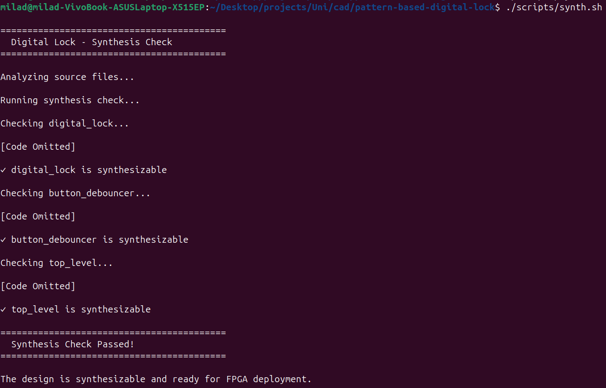

> **[🇬🇧 English Version](README.md)**

# فایل‌های Synthesis (`synthesis/`)

این دایرکتوری برای خروجی‌های synthesis هنگام target کردن FPGA است.

---

## هدف

هنگام synthesis طراحی برای سخت‌افزار واقعی، فایل‌های خروجی اینجا قرار می‌گیرند:
- فایل‌های constraint (`.xdc`، `.qsf`)
- Netlist‌ها
- Bitstream‌ها
- Report‌ها

---

## شروع سریع: بررسی قابلیت Synthesis

```bash
# تأیید اینکه design قابل synthesis است
ghdl --synth --std=08 -e top_level
```

اگر این بدون خطا کامل شود، design قابل synthesis است.



<details>
<summary>Synthesis چیست؟</summary>

**Synthesis** کد VHDL را به سخت‌افزار واقعی تبدیل می‌کند:

1. **Analyze**: parse کردن کد VHDL
2. **Elaborate**: expand کردن generic‌ها، connect کردن component‌ها
3. **Synthesis**: map کردن به logic gate‌ها (LUT، flip-flop)
4. **Place & Route**: تخصیص به منابع فیزیکی FPGA
5. **تولید Bitstream**: ایجاد فایل برای programming FPGA

`--synth` GHDL مراحل ۱-۳ را بررسی می‌کند. Synthesis کامل نیاز به vendor tool‌های مانند Vivado یا Quartus دارد.

</details>

---

## FPGA Vendor Tool‌ها

### Xilinx Vivado (پیشنهادی برای FPGA‌های Xilinx)

1. پروژه جدید ایجاد کنید
2. فایل‌های source از `src/` را اضافه کنید
3. `top_level` را به عنوان top module تنظیم کنید
4. فایل constraint اضافه کنید (به زیر مراجعه کنید)
5. Synthesis → Implementation → Generate Bitstream را اجرا کنید

### Intel Quartus (برای FPGA‌های Intel/Altera)

1. پروژه جدید ایجاد کنید
2. فایل‌های source از `src/` را اضافه کنید
3. `top_level` را به عنوان top entity تنظیم کنید
4. Constraint‌ها (فایل `.qsf`) را اضافه کنید
5. Compile را اجرا کنید

---

## فایل‌های Constraint

### Xilinx (فرمت .xdc)

فایل `constraints.xdc` ایجاد کنید:

```tcl
# Clock (100 مگاهرتز)
set_property PACKAGE_PIN W5 [get_ports clk]
set_property IOSTANDARD LVCMOS33 [get_ports clk]
create_clock -period 10.000 [get_ports clk]

# دکمه Reset
set_property PACKAGE_PIN U18 [get_ports reset]
set_property IOSTANDARD LVCMOS33 [get_ports reset]

# دکمه A
set_property PACKAGE_PIN T18 [get_ports button_A_raw]
set_property IOSTANDARD LVCMOS33 [get_ports button_A_raw]

# دکمه B
set_property PACKAGE_PIN W19 [get_ports button_B_raw]
set_property IOSTANDARD LVCMOS33 [get_ports button_B_raw]

# دکمه C
set_property PACKAGE_PIN T17 [get_ports button_C_raw]
set_property IOSTANDARD LVCMOS33 [get_ports button_C_raw]

# دکمه D
set_property PACKAGE_PIN U17 [get_ports button_D_raw]
set_property IOSTANDARD LVCMOS33 [get_ports button_D_raw]

# LED وضعیت قفل
set_property PACKAGE_PIN U16 [get_ports lock_status]
set_property IOSTANDARD LVCMOS33 [get_ports lock_status]

# خروجی LED
set_property PACKAGE_PIN E19 [get_ports led]
set_property IOSTANDARD LVCMOS33 [get_ports led]
```

<details>
<summary>چگونه Pin assignment‌ها را برای برد خود پیدا کنید</summary>

هر برد FPGA pin mapping متفاوتی دارد. پیدا کنید:

1. مستندات/schematic برد را بررسی کنید
2. فایل "Master XDC" یا "Pin Constraints" را جستجو کنید
3. "[نام برد] xdc file" را جستجو کنید

بردهای رایج:
- Basys 3: [مرجع Digilent](https://digilent.com/reference/programmable-logic/basys-3/start)
- Nexys A7: [مرجع Digilent](https://digilent.com/reference/programmable-logic/nexys-a7/start)
- DE10-Lite: [منابع Terasic](https://www.terasic.com.tw/cgi-bin/page/archive.pl?Language=English&No=1021)

</details>

### Intel Quartus (فرمت .qsf)

```tcl
set_location_assignment PIN_R8 -to clk
set_location_assignment PIN_J15 -to reset
set_location_assignment PIN_H21 -to button_A_raw
set_location_assignment PIN_H22 -to button_B_raw
set_location_assignment PIN_G20 -to button_C_raw
set_location_assignment PIN_G21 -to button_D_raw
set_location_assignment PIN_L21 -to lock_status
set_location_assignment PIN_L22 -to led
```

---

## Configuration برای سخت‌افزار واقعی

قبل از synthesis، generic‌های `top_level.vhd` را update کنید:

```vhdl
-- برای clock 100 مگاهرتز:
DEBOUNCE_TIME => 2_000_000,  -- debounce 20 میلی‌ثانیه
UNLOCK_TIME   => 500_000_000 -- unlock time 5 ثانیه
```

<details>
<summary>محاسبات Timing</summary>

فرمول: `cycle = seconds × frequency`

**Clock 100 مگاهرتز** (period 10 نانوثانیه):
- debounce 20 میلی‌ثانیه: 0.020 × 100,000,000 = 2,000,000
- unlock time 5 ثانیه: 5.0 × 100,000,000 = 500,000,000

**Clock 50 مگاهرتز** (period 20 نانوثانیه):
- debounce 20 میلی‌ثانیه: 0.020 × 50,000,000 = 1,000,000
- unlock time 5 ثانیه: 5.0 × 50,000,000 = 250,000,000

</details>

---

## Resource Utilization مورد انتظار

تخمین استفاده از منابع (متفاوت بر اساس FPGA):

| منبع | استفاده |
|------|---------|
| LUT | ~50-100 |
| Flip-flop | ~30-50 |
| Clock Frequency | >200 مگاهرتز |

این یک design بسیار کوچک است - روی هر FPGA جا می‌شود.

---

## فایل‌های خروجی

پس از synthesis، خواهید داشت:

| نوع فایل | توضیحات |
|----------|---------|
| `.bit` (Xilinx) | Bitstream برای programming FPGA |
| `.sof` (Intel) | SRAM Object File |
| `.rpt` | Resource/timing report‌ها |
| `.dcp` | Design Checkpoint |

---

## Troubleshooting

### "Cannot find entity"

فایل‌های source را قبل از synthesis کامپایل کنید:
```bash
ghdl -a --std=08 src/digital_lock.vhd
ghdl -a --std=08 src/button_debouncer.vhd
ghdl -a --std=08 src/top_level.vhd
```

### "Timing not met"

Design ساده است و باید به راحتی timing را meet کند. اگر نه:
- Clock constraint را بررسی کنید
- مطمئن شوید clock period با oscillator FPGA شما مطابقت دارد

### "Pin not found"

Pin assignment‌ها مختص برد است. مستندات برد خود را برای pin number‌های صحیح بررسی کنید.
